name: inverse
layout: true
class: center, middle, inverse
---
# Hierarchical Abstraction of Execution Traces for Program Comprehension

## Yang Feng
### Kaj Dreef, James A. Jones, and Arie van Deursen
---
layout: false

# Outline
1. Introduction
2. Motivation
3. Approach
5. Evaluation
6. Discussion
7. Conclusion

<!-- ---
template: inverse

# Introduction -->

---

## Introduction
+ Software comprehension is essential while performing maintenance tasks

+ Understanding runtime behavior is complex because execution traces:
    1. are long, *i.e.,* 1.000.000's of events;
    2. contain many low-level details;
    3. contain no abstractions.

+ Previous work focused on:
    + Visualizing traces
    + Discover phases in the execution

<!-- ---
template: inverse

# Motivation -->

---

## Motivation

+ Challenge 1: Information overload

+ Challenge 2: Behaviors Contain Sub-Behaviors

+ Challenge 3: Incomprehensible Execution Traces

<!-- ---

template: inverse

# Approach
## -- Sage -- -->

---

## Sage
+ **Goal**: *Hierarchically abstracting an execution trace into high-level phases.*

--

+ Approach:
  1. Data Collection & Phase Detection
  2. Model Building & Execution Abstraction

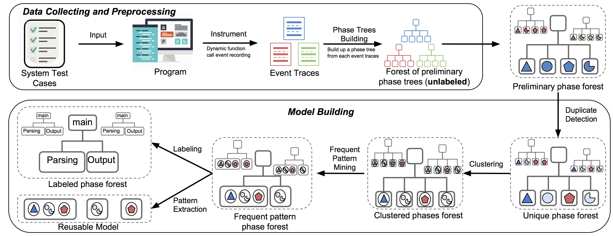

---

.left-column[
## Sage
#### Data Collection

]
.right-column[

+ Dynamic Instrumenter (<a href="https://github.com/spideruci/blinky">Blinky</a>)

+ Collect **only** method-invocation enter events

+ Each method-invocation event is captured as a triple of:
    + Execution ID
    + Method Signature
    + Call depth
]

???

---
.left-column[
## Sage
#### Data Collection
#### Phase Detection
]
.right-column[
Simplified steps of the phase detection:
  1. Input of phase detection is an execution trace

  

      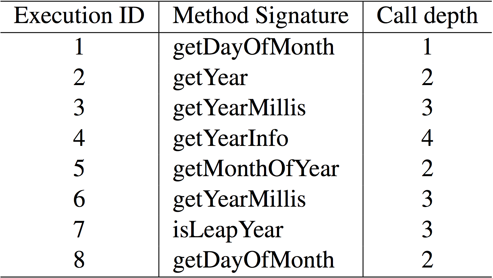</img>
  

]

???

---
count: false
.left-column[
## Sage
#### Data Collection
#### Phase Detection
]
.right-column[
Simplified steps of the phase detection:
  1. Input of phase detection is an execution trace

  

      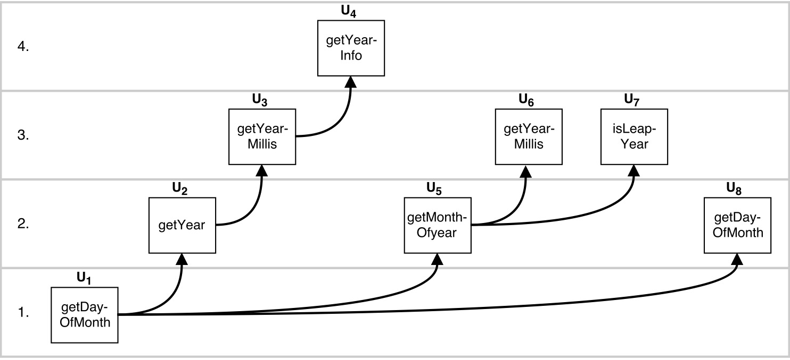</img>
  

]

???

---
count: false

.left-column[
## Sage
#### Data Collection
#### Phase Detection
]
.right-column[
Simplified steps of the phase detection:
  1. Input of phase detection is an execution trace

  2. Use the call depth to locate the phase boundaries
  

      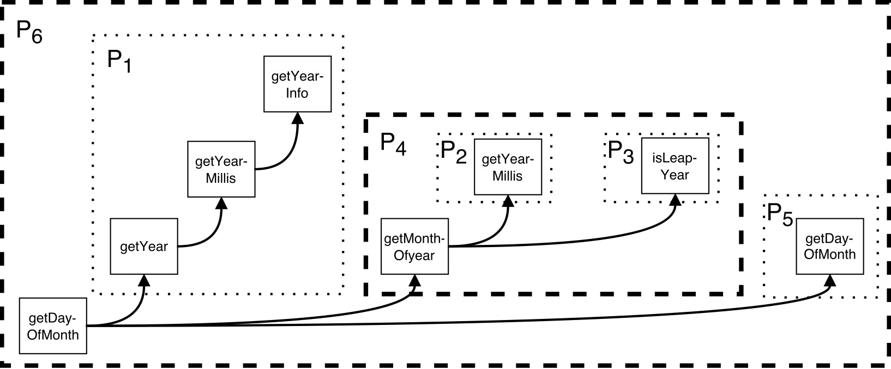</img>
  

]
???

---
count: false

.left-column[
## Sage
#### Data Collection
#### Phase Detection
]
.right-column[
Simplified steps of the phase detection:
  1. Input of phase detection is an execution trace

  2. Use the call depth to locate the phase boundaries

  3.  Finally, the result is a preliminary phase tree
  

      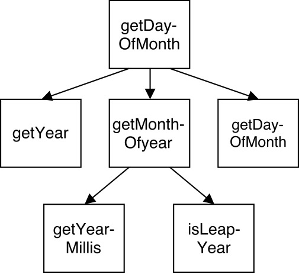</img>
  

]
---
.left-column[
## Sage
#### Data Collection
#### Phase Detection
#### Model Building
]
.right-column[
**Goal**: *Train model to quickly abstract future execution traces.*

]

---
count:false
.left-column[
## Sage
#### Data Collection
#### Phase Detection
#### Model Building
]
.right-column[
**Goal**: *Train model to quickly abstract future execution traces.*

+ **Input**: A set of preliminary phase trees

+ **Approach**: 
    1. Duplicate detection
    2. Phase clustering (Agglomerative clustering)
    3. Frequent pattern mining
    4. Semantic labeling (using TF-IDF)

+ **Output**: A model, which can be seen as a dictionary of recurrent phases.
]

---
.left-column[
## Sage
#### Data Collection
#### Phase Detection
#### Model Building
#### Execution Abstraction
]
.right-column[
+ At this moment we have:

    + an execution trace
    + a model containing the recurrent phases

]

---
count: false
.left-column[
## Sage
#### Data Collection
#### Phase Detection
#### Model Building
#### Execution Abstraction
]
.right-column[
+ At this moment we have:
    + an execution trace
    + a model containing the recurrent phases

+ Abstracting an execution trace needs steps:
    1. Phase detection
    2. Duplicate detection
    3. Apply the model
    4. If necessary, reapply labeling on phases that are not in the model.
]

<!--- EVALUATION....--->
<!-- ---
template: inverse
# Evaluation -->

---

.left-column[
## Evaluation
#### Research Questions
]
.right-column[

**RQ1**: *To what extent does SAGE alleviate the information overload challenge?*

**RQ2**: *Does the hierarchical phase abstraction provide substantially different levels of granularities of behavior?*

**RQ3**: *To what extent are the labeled phases of our approach com- prehensible for developers?*

]
---

.left-column[
## Evaluation
#### Research Questions
#### Methodology
]
.right-column[
1. Quantitative (**RQ1** and **RQ2**):

    + Three projects: *NanoXML*, *Javac*, and *Jedit*.
        1. Determine the reduction in number of phases for each step of the process
        2. Determine number of phases at each level.
]

---
count: false
.left-column[
## Evaluation
#### Research Questions
#### Methodology
]
.right-column[
1. Quantitative (**RQ1** and **RQ2**):
    + Three projects: *NanoXML*, *Javac*, and *Jedit*.
        1. Determine the reduction in number of phases for each step of the process
        2. Determine number of phases at each level.

2. User study (**RQ3**):
    + One project: *Jedit*
    + Compute set of labels for 9 high-level behaviors
    + Let users determine the correct behavior based on the given labels

]

---
count: false
.left-column[
## Evaluation
#### Research Questions
#### Methodology
]
.right-column[
1. Quantitative (**RQ1** and **RQ2**):
    + Three projects: *NanoXML*, *Javac*, and *Jedit*.
        1. Determine the reduction in number of phases for each step of the process
        2. Determine number of phases at each level.

2. User study (**RQ3**):
    + One project: *Jedit*
    + Compute set of labels for 9 high-level behaviors
    + Let users determine the correct behavior based on the given labels

3. Case study (**RQ1**, **RQ2**, and **RQ3**):
    + Abstracted execution trace of *Javac*
    + Present how *Sage* can help program comprehension.
]

---
.left-column[
## Evaluation
#### Research Questions
#### Methodology
#### 1. Quantitative
]
.right-column[

**RQ1**: *To what extent does SAGE alleviate the information overload challenge?*

  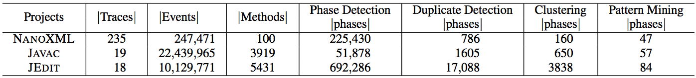</img>

Javac phase distribution:

  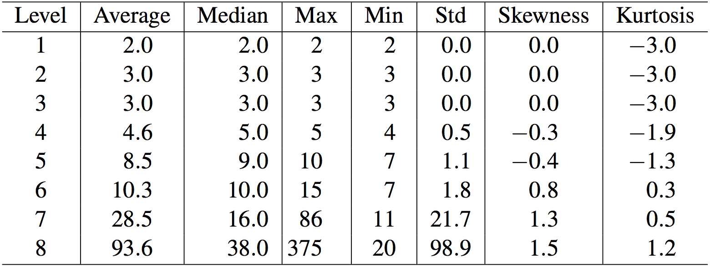</img>
]

---

.left-column[
## Evaluation
#### Research Questions
#### Methodology
#### 1. Quantitative
]
.right-column[

**RQ2**: *Does the hierarchical phase abstraction provide substantially different levels of granularities of behavior?*

Javac phase distribution:

  </img>
]

---
count: false
.left-column[
## Evaluation
#### Research Questions
#### Methodology
#### 1. Quantitative
#### 2. User Study
]
.right-column[
**RQ3**: *Are the derived labels sufficiently meaningful?*

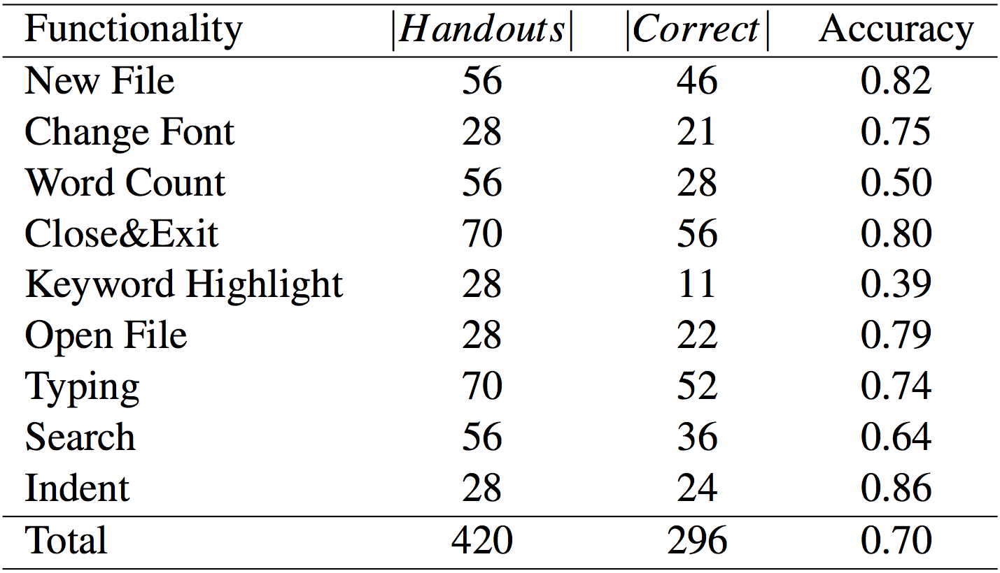</img>
]

---

count: false
.left-column[
## Evaluation
#### Research Questions
#### Methodology
#### 1. Quantitative
#### 2. User Study
#### 3. Case Study
]
.right-column[
**RQ3**: *Are the derived labels sufficiently meaningful?*

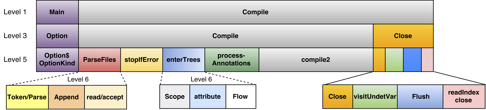</img>
]

<!-- ---
template: inverse

# Discussion -->

---
## Discussion

#### 1. Addressing Information Overload
  + Execution traces contain millions of events
  + Sage output in the tens of phases

--

#### 2. Addressing Behavior Subsumption
  + Sage output provides multiple levels of granularity

--

#### 3. Addressing Comprehensibility of Execution Traces
  + Average behavior identification accuracy of 70%

<!--- Conclusion....--->
<!-- ---
template: inverse
# Conclusion -->

---

## Conclusion
+ We introduced:
    + *Sage*: Hierarchically abstracts an execution trace.

+ The **quantitative evaluation** revealed us that *Sage* can successfully abstract the execution trace and reduce the amount of data to be inspected.

+ The **user study** showed us that for most functionalities the users were able to achieve a 70% accuracy.

+ The **case study** demonstrates *Sage* ability to reveal the primary behavior phases within a large execution.

<!------------------------------------------------------------------------
FINISHED PRESENTATION All further slides are extra slides for the defense
-------------------------------------------------------------------------->

---
template: inverse
count: false

# Extra Slides!

---
count: false

.left-column[
## SageVis
#### Data Structure
]
.right-column[

    
<b>Only Phase Detection</b>

    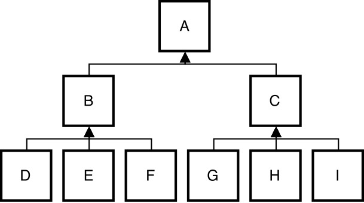</img>

    
<b>FPM</b>

    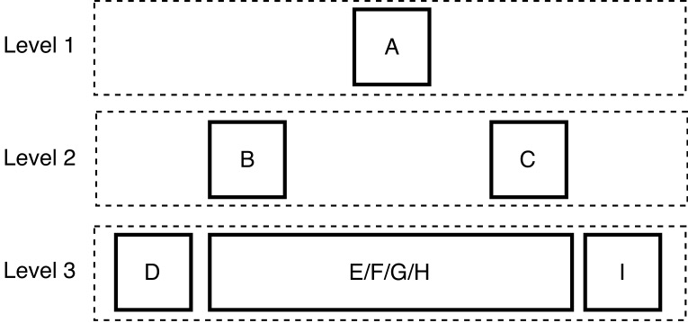</img>

    
<b>FPM with boundaries</b>

    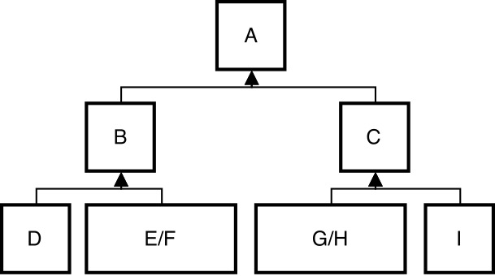</img>

]

---
count: false
.left-column[
## Evaluation
#### Computational Efficiency
]
.right-column[

**RQ4**: *What is the computational efficiency of each abstraction step of Sage*?

Size abstraction for each step of the training procedure in seconds

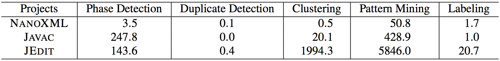

Abstraction time cost in seconds

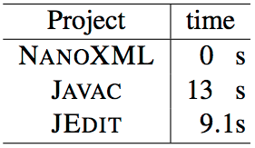
]

---
count:false
## Example: Duplicate Detection and Clustering

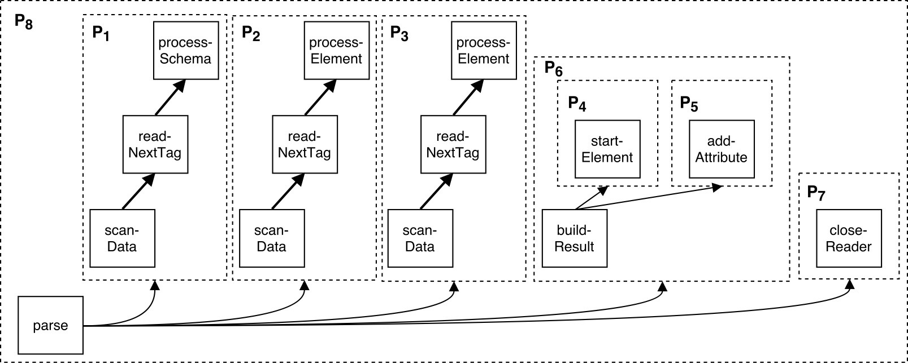</img>

---
count:false
## NanoXML distribution

    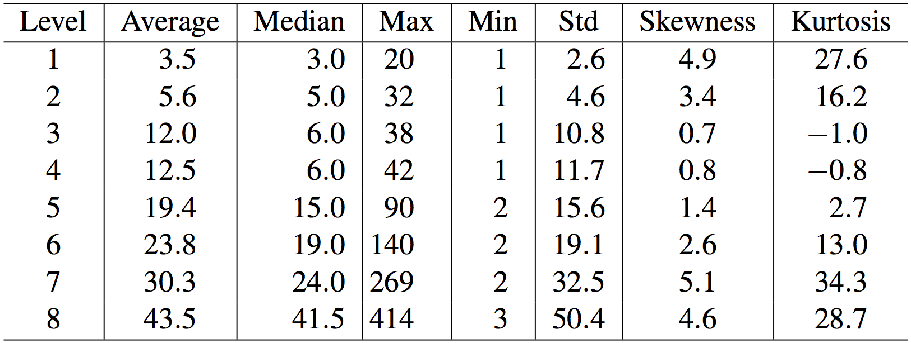</img>

---
count:false
## JEdit distribution

    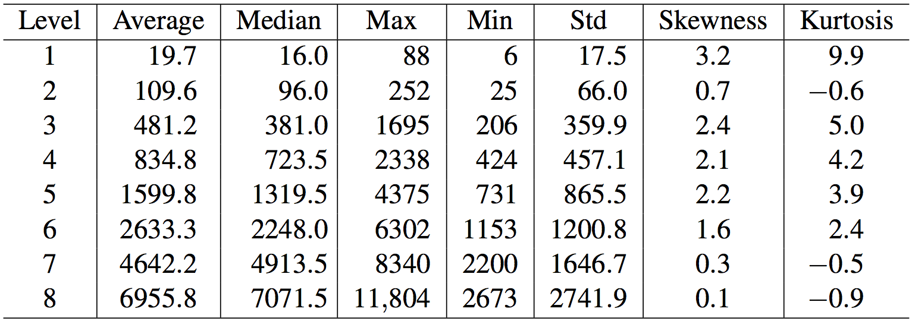</img>

---
count:false
.left-column[
## Sage
#### Data Collection
#### Phase Detection
#### <li style="text-indent: 10%"> Algorithm</li>
]
.right-column[
#### Algorithm: Main loop

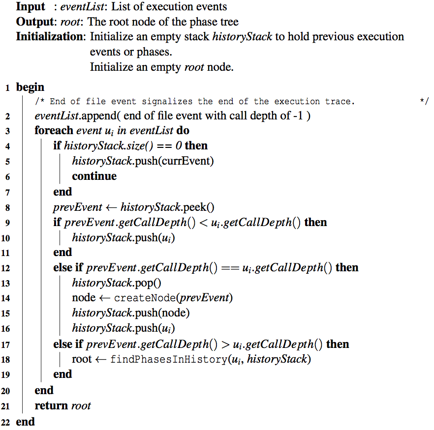</img>
]

---
count:false
.left-column[
## Sage
#### Data Collection
#### Phase Detection
#### <li style="text-indent: 10%"> Algorithm</li>
#### <li style="text-indent: 10%"> Example</li>
]
.right-column[
## Step 1: Initial trace - Push to history stack
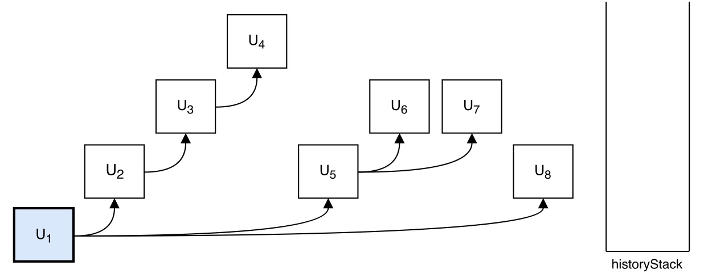</img>
]

---
count: false

.left-column[
## Sage
#### Data Collection
#### Phase Detection
#### <li style="text-indent: 10%"> Algorithm</li>
#### <li style="text-indent: 10%"> Example</li>
]
.right-column[
## Step 2: Push to history stack
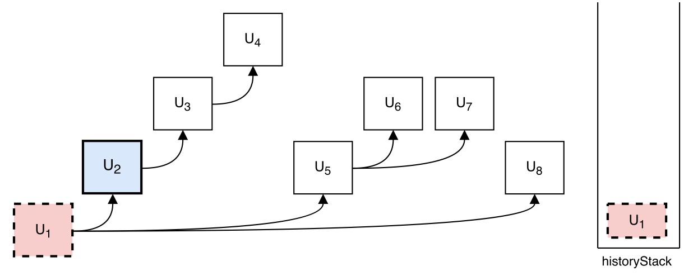</img>
]

---
count: false

.left-column[
## Sage
#### Data Collection
#### Phase Detection
#### <li style="text-indent: 10%"> Algorithm</li>
#### <li style="text-indent: 10%"> Example</li>
]
.right-column[
## Step 3: Push to history stack
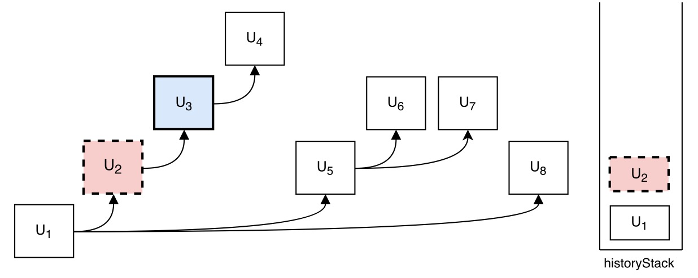</img>
]

---
count: false

.left-column[
## Sage
#### Data Collection
#### Phase Detection
#### <li style="text-indent: 10%"> Algorithm</li>
#### <li style="text-indent: 10%"> Example</li>
]
.right-column[
## Step 4: Push to history stack
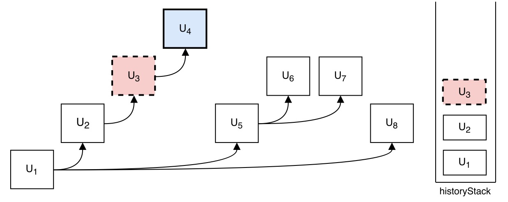</img>
]

---
count: false

.left-column[
## Sage
#### Data Collection
#### Phase Detection
#### <li style="text-indent: 10%"> Algorithm</li>
#### <li style="text-indent: 10%"> Example</li>
]
.right-column[
## Step 5: Stagnation!
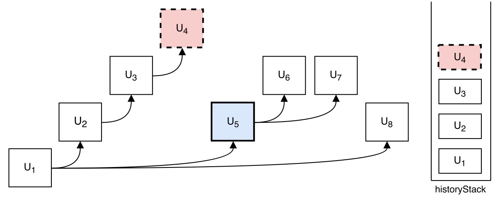</img>
]

---
count: false

.left-column[
## Sage
#### Data Collection
#### Phase Detection
#### <li style="text-indent: 10%"> Algorithm</li>
#### <li style="text-indent: 10%"> Example</li>
]
.right-column[
## Step 6: Push to history stack
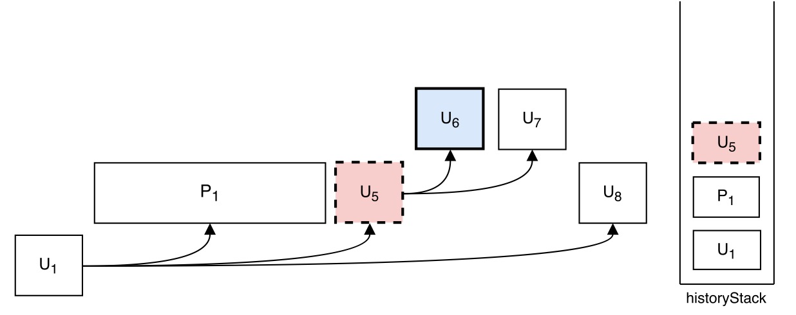</img>
]

---
count: false

.left-column[
## Sage
#### Data Collection
#### Phase Detection
#### <li style="text-indent: 10%"> Algorithm</li>
#### <li style="text-indent: 10%"> Example</li>
]
.right-column[
## Step 7: Stagnation!
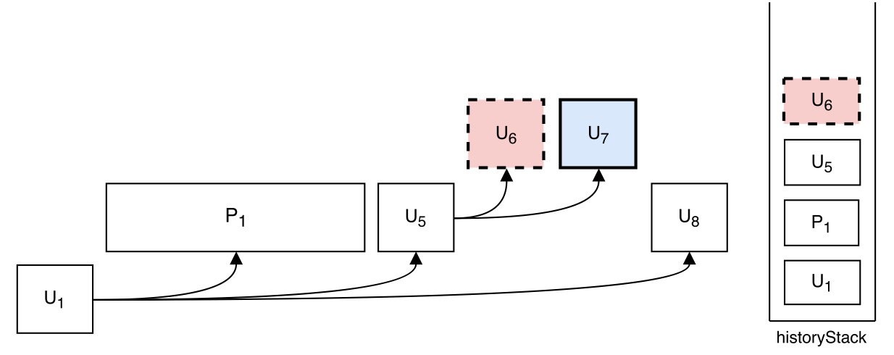</img>
]

---
count: false

.left-column[
## Sage
#### Data Collection
#### Phase Detection
#### <li style="text-indent: 10%"> Algorithm</li>
#### <li style="text-indent: 10%"> Example</li>
]
.right-column[
## Step 8: Stagnation!
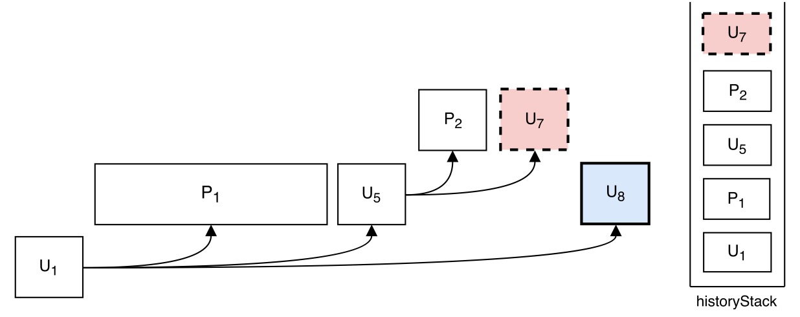</img>
]

---
count: false

.left-column[
## Sage
#### Data Collection
#### Phase Detection
#### <li style="text-indent: 10%"> Algorithm</li>
#### <li style="text-indent: 10%"> Example</li>
]
.right-column[
## Step 9: End of trace -> Stagnation!
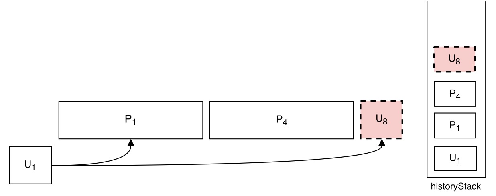</img>
]

---
count: false

.left-column[
## Sage
#### Data Collection
#### Phase Detection
#### <li style="text-indent: 10%"> Algorithm</li>
#### <li style="text-indent: 10%"> Example</li>
]
.right-column[
## Finally: Preliminary Phase Tree
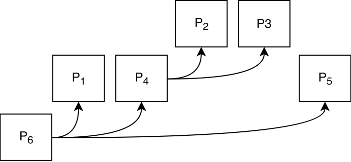</img>
]

---
count: false

## Future work

### - Overall

+ Multithreaded support
+ Evaluate *Sage* and *SageVis* on larger systems

### - Visualization

+ Dynamically Inferred State Machine
