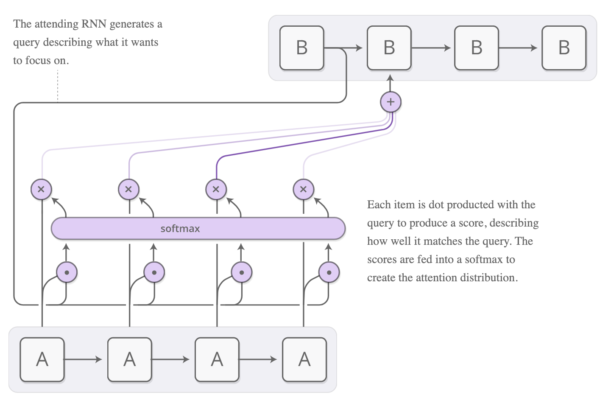
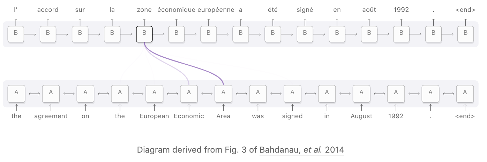
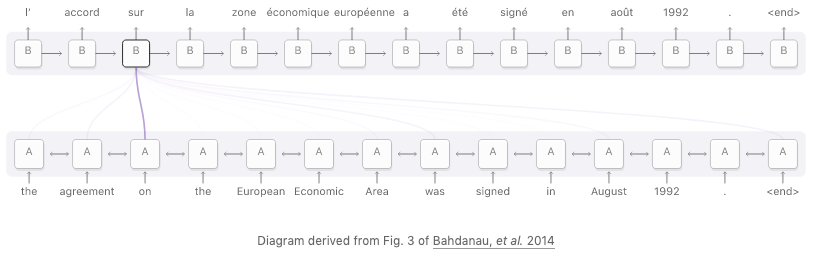
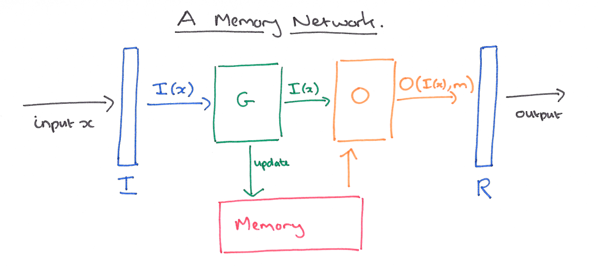

# Attention Mechanism and Memory Networks

----  ----

## Attention Mechanism

* **Idea**: Focus on a subset of the data
* <!-- .element: class="fragment" -->
    Attention forms a mapping between parts of the input and corresponding output sequence.
    + Difficult to learn these mappings...
    + How do you learn to recognize these mappings?

----  ----

## Didn't LSTM solve this?

+ Sort of...
    + However, with LSTM each previous step influences the incoming LSTM cell state.
    + With an Attention Mechanisms this doesn't have to be the case.

----  ----

## Attention Mechanism
#### Example: Translation Architecture

[source](https://distill.pub/2016/augmented-rnns/#attentional-interfaces)

----  ----

## Attention Mechanism
#### Example: Translation 1

[source](https://distill.pub/2016/augmented-rnns/#attentional-interfaces)

----  ----

## Attention Mechanism
#### Example: Translation 2

[source](https://distill.pub/2016/augmented-rnns/#attentional-interfaces)

----  ----

# Memory

<table>
    	<thead><tr>
            <th>Human Memory</th>
            <th>Computer Memory</th>
        </tr></thead>
        <tbody>
            <tr>
                <td>Short-term</td>
                <td>Registers</td>
            </tr>
            <tr>
                <td>Working</td>
                <td>RAM</td>
            </tr>
            <tr>
                <td>Long-term</td>
                <td>SSD/HDD</td>
            </tr>
        </tbody>
</table>

 

+ <!-- .element: class="fragment" --> But... how about Neural Networks?

    - RNN
    - LSTM/GRU
    - Memory Networks

----  ----

## Different Types of Memory

+ <!-- .element: class="fragment" -->      
    **Recurrent Neural Networks** (RNN)
    - Allows us to take previous states into account, but *not* control the relevance of each element in that state.
    - But [vanishing and exploding gradient problem](https://en.wikipedia.org/wiki/Vanishing_gradient_problem)...
    - And no *external* memory
+ <!-- .element: class="fragment" -->  
    **[Long Short Term Memory (LSTM)](https://colah.github.io/posts/2015-08-Understanding-LSTMs/)**
    - Allows us to take previous state into account and *control* the 'relevance' of each element in that state.
    - But still, no *external* memory
+ <!-- .element: class="fragment" -->  
    **[Memory Networks](https://arxiv.org/pdf/1410.3916.pdf)**
    - External memory bank
    - Read and Write capabilities

----  ----

# Memory Network

> Memory networks reason with inference components combined with a long-term memory component; they learn how to use these jointly.
>
> \- [Weston et al., 2015]

- Memory Networks are also called MemNN (Memory Neural Networks)

----  ----

# Memory Network - Architecture 1

+ Combines two types of memory:
    - Internal memory (e.g., LSTM)
    - External Memory

+ External memory can contain a knowledge base or store data that has been computed.

----  ----

# Memory Network - Architecture 2

+ I: contains the input
+ G: Updates the memories based on the input
+ O: Creates the output based on input and updated memories.

[source](https://blog.acolyer.org/2016/03/10/memory-networks/)

----  ----

## Attention Mechanism and External Memory

+ Attention Mechanism enables us to train an NN with external memory (because it returns a distribution).

+ Different ways to access the memory:
    + **Location-based**: Allows relative movement in memory.
    + **Content-based**: Allows us to search through the memory and focus on places that match what we are looking for.

----  ----

# More References:

+ [Neural Machine Translation with Attention](https://www.tensorflow.org/alpha/tutorials/text/nmt_with_attention)
+ [Complete code examples for Machine Translation with Attention, Image Captioning, Text Generation, and DCGAN implemented with tf.keras and eager execution](https://medium.com/tensorflow/complete-code-examples-for-machine-translation-with-attention-image-captioning-text-generation-51663d07a63d)
+ [Attention and Augmented Recurrent Neural Networks](https://distill.pub/2016/augmented-rnns/)
+ [Attention Mechanisms and Memory Networks](https://skymind.ai/wiki/attention-mechanism-memory-network)
+ [Morning Paper - Memory Networks](https://blog.acolyer.org/2016/03/10/memory-networks/)
+ [Morning Paper - Neural Turing Machines](https://blog.acolyer.org/2016/03/09/neural-turing-machines/)