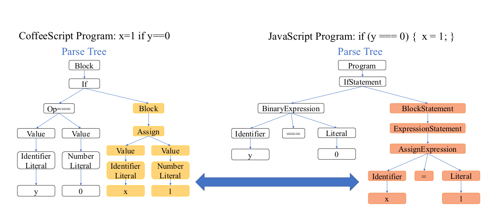
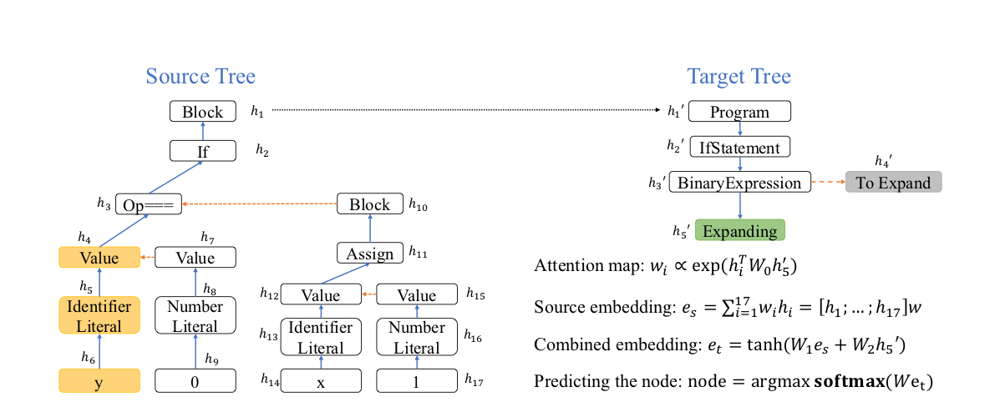
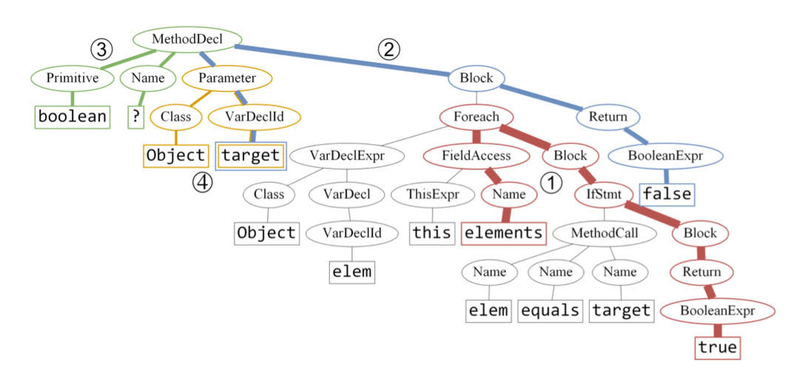
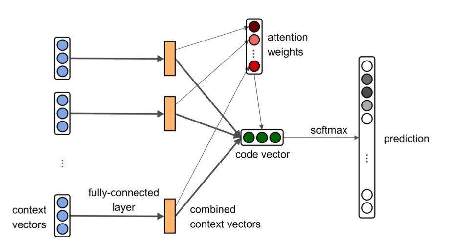

# Tree-to-Tree Neural Networks for Program Translation

----

## Goal
> Translate a program's source code written in one language to another

----

## Natural vs Programming Languages translation

|                              | Natural       | Programming |
|------------------------------|---------------|-------------|
| Grammar                      | Less Rigorous | Rigorous    |
| Tolerant to typos            | Yes           | No          |
| Tolerant to grammar mistakes | Yes           | No          |

----

## RNN-based sequence generator not suitable
+ Difficult to generate syntactically correct programs.
+ Because, it entangles the two subtasks
    1. Learning the grammer
    2. Aligning the sequence with the grammer

----

## So what else?

+ Utilize structural information of AST to separate subtasks.
    + Input: Abstract Syntax Tree of L1
    + Output: Abstract Syntax Tree of L2

----

## Architecture

+ Tree-to-tree Neural Network
    - Encoder-decoder framework
        - Tree-Encoder: encode the source tree into an *embedding*
        - Tree-Decode: decode the *embedding* into the target tree.
        - (Both tree-RNN)
    - Tree Attention Mechanism
        1. Attention mechanism to locate the source sub-tree
        2. Parent attention feeding

----

## Example (1)



----

## Example (2)



----

## Future work

+ How to generalize to programs longer than the trained ones?
+ Training requires a dataset of aligned input-output pairs

----

# References:

+ [Tree-to-Tree Neural Networks for Program Translation](https://arxiv.org/pdf/1802.03691.pdf)
+ [Improved Semantic Representations FromTree-Structured Long Short-Term Memory Networks](https://arxiv.org/pdf/1503.00075.pdf)
+ [Language to Logical Form with Neural Attention](https://arxiv.org/pdf/1601.01280.pdf)
+ [Slides on Tree-LSTM](https://www.slideshare.net/tuvistavie/tree-lstm)

----

# code2vec: Learning Distributed Representations of Code

----

> Goal: Learning *code embeddings*, continuous vectors for representing snippets of code


> Motivating tasks: *Semantic labeling of code snippets*

----

## Different representations (input to model)

+ Text --> Tokens or source Code
+ Tree --> Abstract Syntax Trees (AST)
+ Path-Contexts --> Different paths within (AST)

----


## Path-contexts (1)
```java
boolean f(Object target) {
    for (Object elem: this.elements) {
        if (elem.equals(target)) {
            return true;
        }
    }
    return false;
}
```

----

## Path-contexts (2)



Top 4 context-paths within AST

+ Context-paths (<sub><sup><start_element, path, end_element></sup></sub>)
+ Example of context-path (1) Red Line:
<sub><sup><elements,Name&uarr;FieldAccess&uarr;Foreach&darr;Block&darr;IfStmt&darr;Block&darr;Return&darr;BooleanExpr, true></sup></sub>

----

## Architecture



+ Fully connected layer
+ Attention Mechanism to determine which context vector get a higher weight
+ Encode many context vectors in a single *code vector*

----

## References:

+ [code2vec - code](https://github.com/tech-srl/code2vec)
+ [code2vec - paper](https://arxiv.org/pdf/1803.09473.pdf)

+ Other interesting paper possibly:
    + [code2seq - code](https://github.com/tech-srl/code2seq)
    + [code2seq - paper](https://arxiv.org/pdf/1808.01400.pdf)
