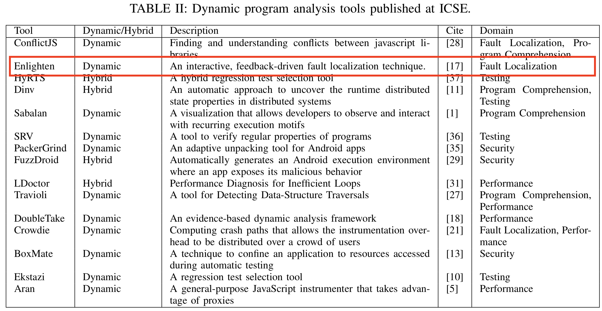

# Dynamic Analysis: 
## A Survey of the Current State-of-the-Art
#### Kaj Dreef

----

## Quick Recap (1): Definitions

+ **Static Analysis**: Analyzes the source code of the program.
+ **Dynamic Analysis**: Analyzes runtime behavior of the program.
+ **Instrummention**: A way to log executions that happen during runtime.

----

## Quick Recap (2): Static vs Dynamic

| **Static Analysis**             | **Dynamic Analysis**                          |
|---------------------------------|-----------------------------------------------|
| Source Code                     | Running software                              |
| Less precise                    | More precise                                  |
| Observe all possible executions | Limited to observed executions during runtime |
| Sound                           | Unsound                                       |

----

## Introduction

+ Dynamic analysis actively researched in many domains
    + Program Comprehension, Cornelissen et al., [[1](https://www.researchgate.net/profile/Leon_Moonen/publication/224401954_A_Systematic_Survey_of_Program_Comprehension_through_Dynamic_Analysis/links/0912f50a365289ecd7000000.pdf)]
    + Malware-Analysis, Egele et al., [[2](https://sites.cs.ucsb.edu/~chris/research/doc/acmsurvey12_dynamic.pdf)]
    + Test-Generation, Andreasen et al., [[3](http://mp.binaervarianz.de/js_survey_2017.pdf)]

+ However, an overview of the domains and the challenges imposed by those domains is not available.

+ Closest is a survey of dynamic analysis tools which has a narrower scope [[4](https://link.springer.com/chapter/10.1007%2F978-3-319-11933-5_13)]
    + Compares different approaches to instrument a program.
    + Compare different dynamic analysis tools, however, the selection discussed is more limited and much of the newly published research is left out.

----

## Goal

> Classify dynamic analysis techniques into domains and extract techniques used within those domains that could be translated to other domains.

----

## Research Questions

1. How can the existing literature on dynamic program analysis be classified?
2. What is the current state-of-the-art?
3. Where are the gaps within the dynamic program analysis field?

----

## Research Methodology (1)

----

## Research Methodology (2)

| **Venue** | **Initial** | **Pre-Selection**   | **Final-Selection** | **# of years** |
|-----------|-------------|---------------------|---------------------|----------------|
| ICSE      | 358         |  34                 | 22                  | 4              |
| ASE       | 239         |  30                 | 23                  | 3              |

----

## Taxonomy

----

## Current State-of-the-Art (1): ICSE tools

----

## Current State-of-the-Art (1): ICSE tools - DoubleTake

----

## Current State-of-the-Art (1): ICSE tools - Enlighten

----

## Current State-of-the-Art (2): ASE tools

<!-- .element height="70%" width="70%" -->

----

## Current State-of-the-Art (2): ASE tools - Getty

<!-- .element height="70%" width="70%" -->

----

## Current State-of-the-Art (3): Summary

+ Focusses on a broad variety of domains
+ But some themes show up in all the different domains
    + *Overhead*: 
        + Hybrid approach using static analysis to inform the dynamic analysis
    + *Unsoundness*:
        + Use dynamic analysis to improve static analysis at specific points

----

## Gaps/Challenges within the Dynamic Analysis Field

+ Scalability/Overhead - Creating dynamic analysis tools that scale to large systems.
+ Concurrency/Distributed Systems
+ Interactive/Feedback-driven dynamic analysis

----

## Threats to validity

+ Limited set of venues
    + However, chosen venues are prominent in the Software Engineering
+ Characterization of papers was done by a single person which can lead to a bias in the coding

----

## Conclusions

+ Dynamic analysis is used in a broad set of topics
+ And tools (of course) are highly specified to their goal
+ But there are techniques (e.g., hybrid, interactive/feedback driven) that can be used in other domains as well.

----

## Future Work

+ Currently, survey limited to ICSE and ASE over the last 4 years.
    + Expend to last decade;
    + Expend venues to FSE, ICPC, IISSTA, SCAM, TOSEM, TSE, VISSOFT, etc.

+ Have not (yet) non-recursively gone through the related work, so seminal work is (probably) missing