# Dynamic Dependence Summaries
#### Authors: Vijay Krishna Palepu, Guoqing Xu, James A. Jones

----

## Quick Recap (1): Definitions

+ **Static Analysis**: Analyzes the source code of the program.
+ **Dynamic Analysis**: Analyzes program while running.
+ **Instrummention**: A way to log executions that happen during runtime.
+ [**Blinky**](https://github.com/spideruci/blinky): An instrumentation tool for Java

----

## Quick Recap (2): Static vs Dynamic

| **Static Analysis**             | **Dynamic Analysis**                          |
|---------------------------------|-----------------------------------------------|
| Source Code                     | Running software                              |
| Less precise                    | More precise                                  |
| Observe all possible executions | Limited to observed executions during runtime |

----

## Quick Recap (3): Dynamic Analysis Challenges

1. Execution traces from even small executions can become massive (1.000.000+ lines)
    + How to decrease the execution trace size w/o losing valuable data?
    + How to extract valuable information from them?

2. Instrumentation causes major runtime overhead
    + How to decrease the overhead?

----

## Introduction

+ Modern Software Systems are build upon other libraries, APIs, etc.
+ One of the *challenges* of component reuse: 
    + Analysis tasks become increasingly expensive as the extent and depth of component reuse increases.

    + In a perfect world, we do a complete and exhaustive analysis where all underlying components are taken into account.
    + ... However, not realistic, because computationally expensive.

----

## Execution Trace (1)

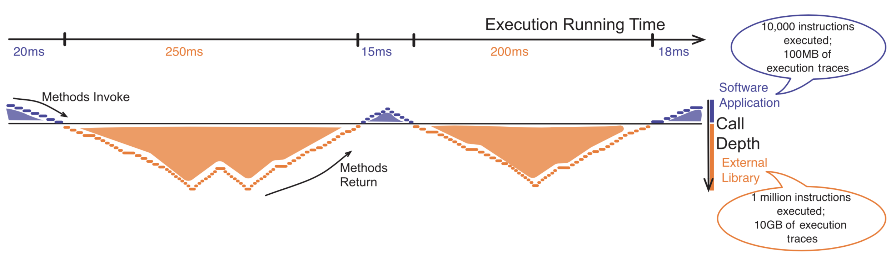

----

## Execution Trace (2)

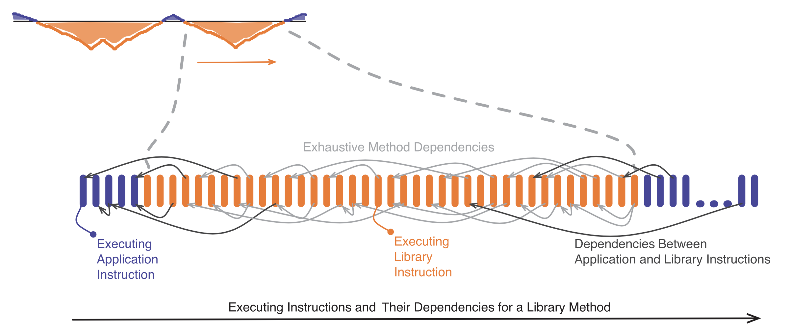

----

## What can we do?

+ **Static Analysis** &rarr; Summary-based Program Analysis
+ **Dynamic Analysis** &rarr; ??

----

## Introduction (3)

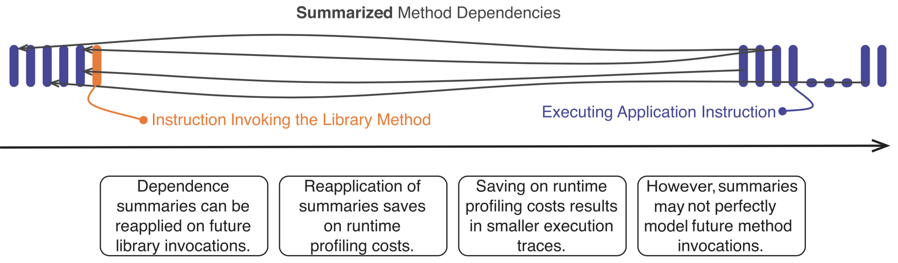

----

## Pilot Study: 
#### Possible gains of summarizing the Java Standard Library

| Tool   | # instructions | # rt.jar instructions | Possible win |
|--------|----------------|-----------------------|--------------|
| Bloat  | 396x10^6       | 239x10^6              | 60%          |
| Jython | 1,734x10^6     | 1658x10^6             | 95%          |
| FOP    | 110x10^6       | 57x10^6               | 51%          |
| PMD    | 18x10^6        | 9x10^6                | 50%          |

+ On avergage nearly 65%

----

## Idea: Dynamic Dependence Summaries (1)

> "Dynamically compute dependence summary metadata that will characterize and capture external effects of reused components for a modern object-oriented language, where we treat each method as a component unto itself."

----

## Dynamic Dependence

Given two memory locations, l1 and l2, they are said to be dynamically dependent under the following two conditions:

+ **Dynamic data dependence** - A runtime instruction writes a value to the memory location l2 that is computed using the value read from memory location l1.

+ **Dynamic control dependence** - A runtime instruction that writes a value to the memory location l2 and the occurence of the runtime instruction was predicated on the value at memory location l1.
```
if (l1 == ...) {
    write to l2
}
```


----

## Goal: Dynamic Dependence Summaries

Summary-based approach to dynamic dependence analysis leads to:
1. Reduced execution trace size.
2. Reduced trace recording times.
3. Reduced dynamic dependence analysis time.

----

## Why do we care?

+ Dynamic Dependence Analysis forms the basis of a variety of dynamic analysis techniques:
    + [Dynamic Program Slicing](https://www.cs.columbia.edu/~junfeng/08fa-e6998/sched/readings/slicing.pdf)
    + [Tainting-based Information Flow Analysis](http://web.cs.ucla.edu/~harryxu/papers/xu-tosem15.pdf)
    + [Potential Parallelism Detection](http://web.cse.ohio-state.edu/~pouchet.2/doc/pldi-article.12.pdf)

+ *Summary-based Dynamic Dependence Analysis* can improve the efficiency (space/time) for all such techniques.

----

#### Dynamic Dependence Summaries...
## Why not use the static summaries?

+ Static Summaries are more conservative than Dynamic Summaries
    + e.g., Dynamic Dispatch, access individual array elements...

----

## Example: Dynamic Summaries - Code

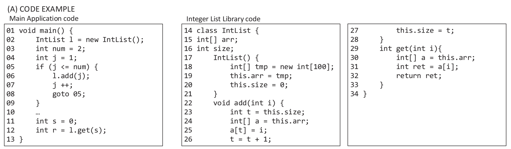

----

## Example: Dynamic Summaries - Execution Trace

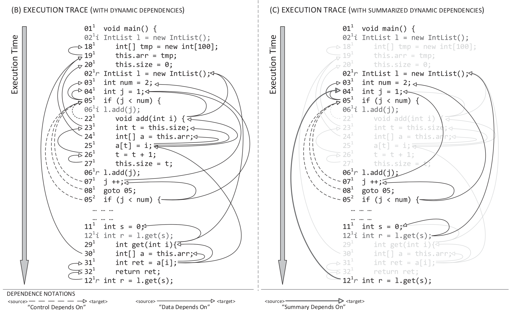

+ Note the reduction in:
    1. Number of (data/control) dependencies 
    2. Number of executions in the trace.
<!-- + Note: `i` are invocations, and `r` are the invocations return. -->

----

## Example: Dynamic Summaries - Trace with Summaries

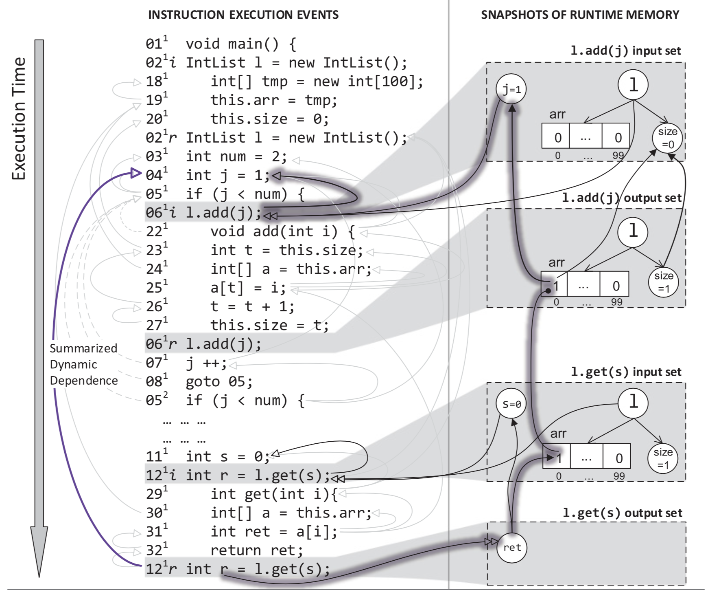


----

## Challenges

1. Defining Dependence Summaries with Objects

2. Abstracting Concrete Summaries

    <!-- 1. Abstracting Concrete Array Accesses -->
3. Accounting for Varying Method Behavior

    <!-- 1. Accounting for Polymophic Methods
    2. Accounting for Divergent Control Flow -->
4. Reusing Dynamic Dependence Summaries

----

## Create a Dynamic Dependence Summary


1. Obtain the **Concrete Summaries**, i.e., a set of dynamically observed data or control dependencies between the inputs and outputs of a specific infocation of a given method.
2. Obtain the **Abstract Summaries**, i.e., Replace concrete information with suitable abstract information.
3. Obtain the **Aggregate Dependence Summary**, i.e., for method invocation of a given method that share the same dynamically observed input argument types perform a union of all inputs, outputs, and dependence edges of the abstract summary.

----

## Step 1: Concrete Summaries

<!-- .element height="40%" width="50%" -->

----

## Step 2: Abstract Summaries

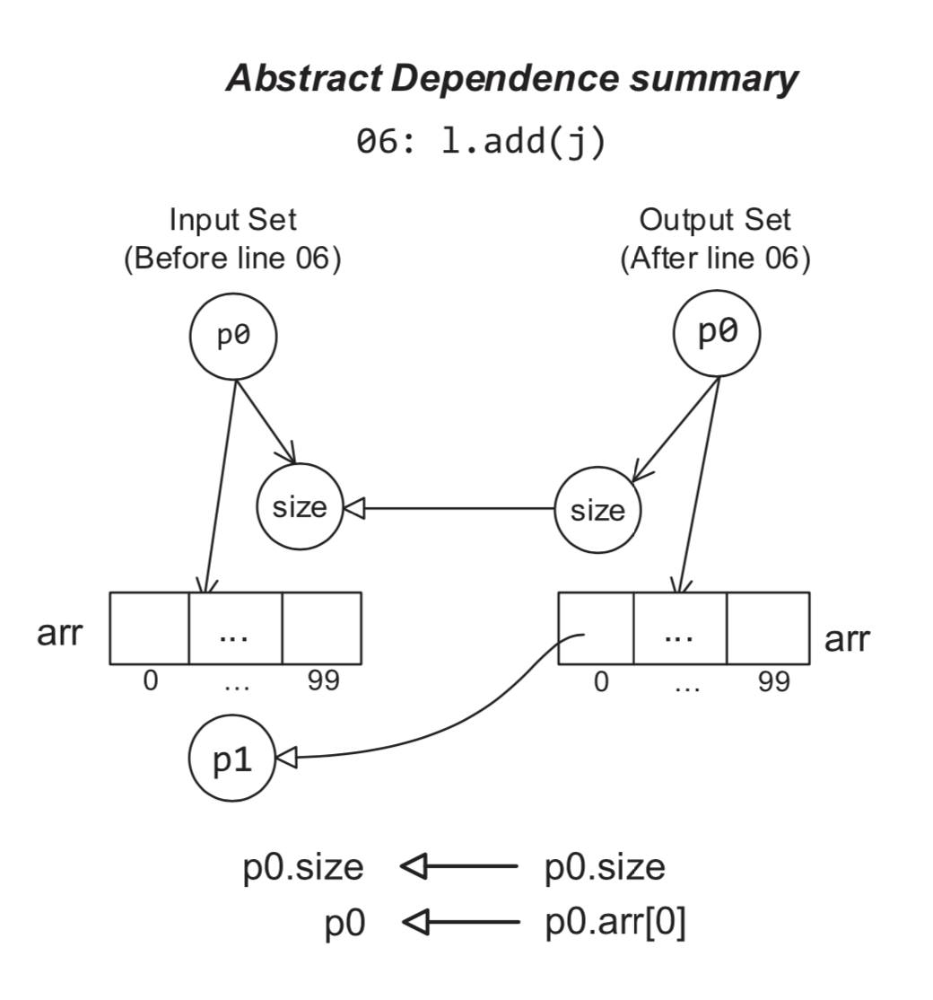<!-- .element height="40%" width="50%" -->

----

## Step 3: Aggregate Dependence Summary

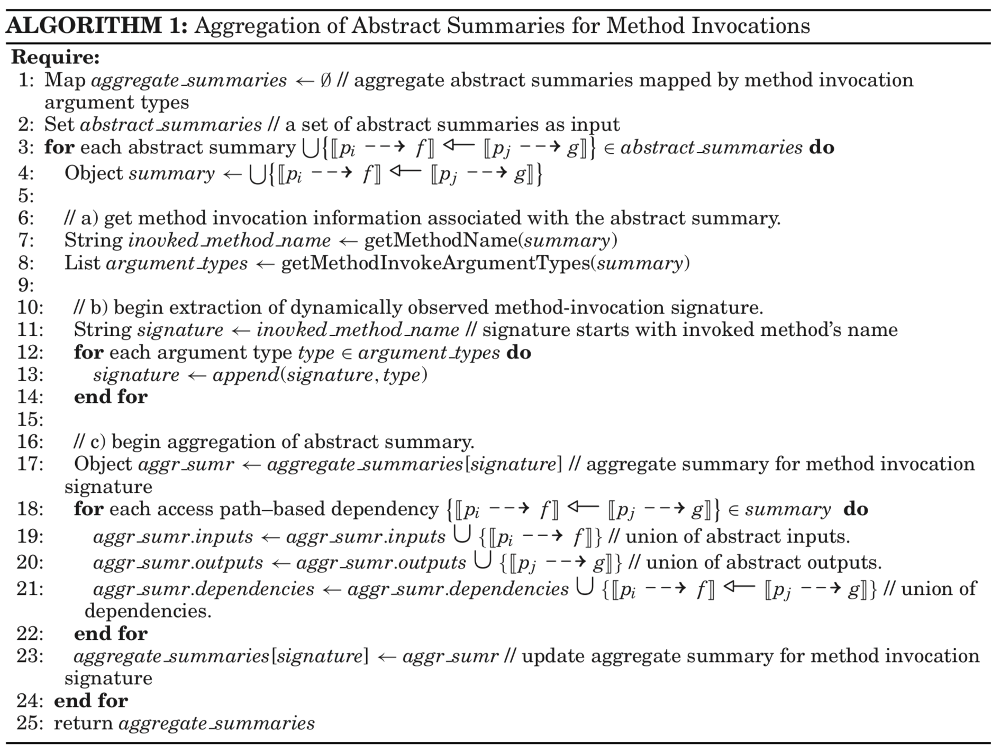

----

## Summary Application

1. Symbolic names in a method summary's input and output sets are substituted with their respective concrete locations at a method invocation.
2. Dependencies between the input and output of a method invocation are used to derive the runtime dependencies.

----

## Summary Application: Example - Code


----

## Summary Application: Example - Summary l.add(j) (1)

<!-- .element height="40%" width="50%" -->

+ Sustitute p0 with O02 and p1 with i

----

## Summary Application: Example - Summary l.add(j) (2)

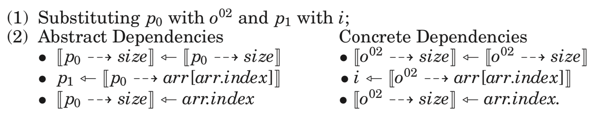

----

## Evaluation: Research Questions

Research Questions:
1. What is the extent to which summaries potentially assist in cost saving?
2. What are the performance cost savings with the use of dynamic dependence summaries for dynamic analysis?
3. How does the use of dynamic data and aggregation of concrete dynamic dependence summaries affect the accuracy of dynamic analysis?
4. How does the use of dynamic dependence summaries affect the efficiency and effectiveness of a runtime client analysis?

----

## Evaluation: 
### RQ1 - Potential Cost Savings

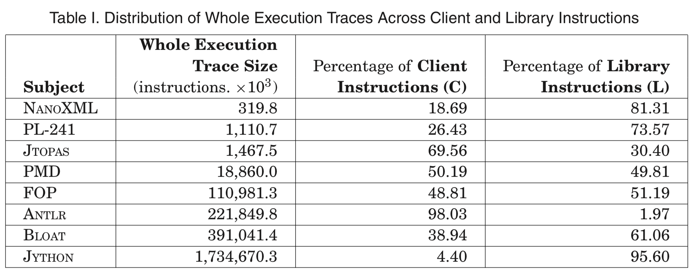

----

## Evaluation:
###  RQ2 - Efficiency

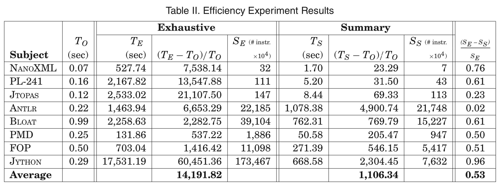

+ T = Execution Time, To = Mean Execution Time
+ S = Mean runtime overhead for each technique

----

## Evaluation:
### RQ3 - Accuracy

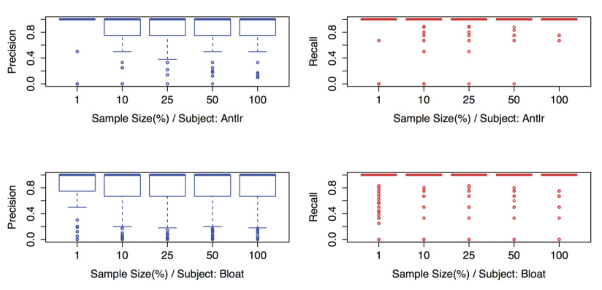


----

## Evaluation:
### RQ4 - Summarized Dynamic Slicing Case Study

+ Use backward dynamic slicing to find the cause of 20 faulty inputs.

+ One Dynamic Slice was done on the whole trace and the other using Dynamic Dependence Summaries.

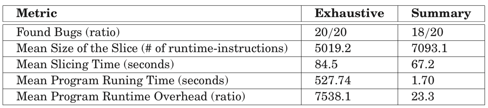


----

## Results:

+ 13 x speedup with the use of dynamic dependence summaries.
+ with an accuracy of 90%.


----

## Limitations

+ Test Suite is needed for creating summaries
    + How does quality of test suite impact the ability to create summaries?
    + When change is made to summarized method do we each time need to rerun summarizing?

+ What are characteristics of a library that make them suitable for summarization?

+ Speed up is 13x in comparison to dynamic analysis without summaries. Dynamic Analysis will still be very expensive.

----

## Recap

+ Introduced a Dynamic Dependence Summaries
    + Potential high cost savings
    + Reuse of dynamic summaries caused the costs in performing dynamic dependency analysis to be significantly reduced.
    + Can lead to a perceptible loss of accuracy. 
    + Traceoff: Small loss of accuracy for performance gain.

----

## Instrumentation: Blinky

Goal: Generation of a detailed trace that records the execution of each instruction in the program and the heap/stack location it accesses.

+ Instrumentation is done on the fly (during runtime)
+ Uses ASM (i.e., Java Bytecode Manipulation Framework)

