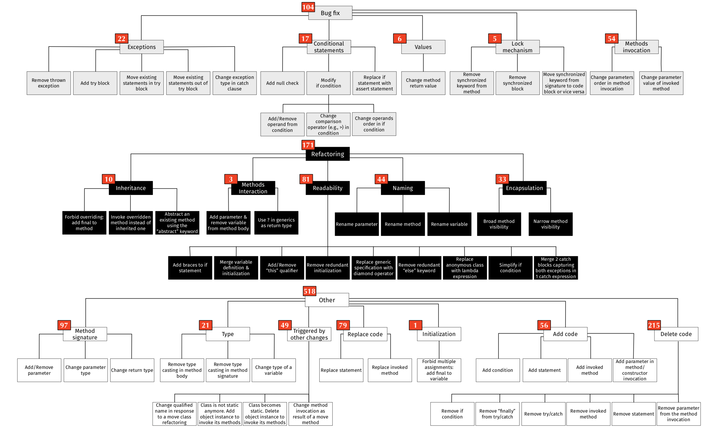

<!-- On Learning Meaningful Code Changes via Neural Machine Translation -->
# [Paper 1](https://arxiv.org/pdf/1901.09102.pdf)

ICSE'19

----

## Goal

> Applying Deep Learning to source code to automate non-trivial coding activities, e.g., refactoring.

----

## What does the network learn?

+ Input: Initial code change in pull request
+ What to learn?
    + Code transformations done in Pull Request

----

## Research Questions

1. Can NMT be employed to learn meaningful code changes?

2. What types of meaningful code changes can be performed by the model?

----

## Model Architecture

+ RNN Encoder-Decoder
+ Attention Mechanism
+ Beam Search Decoding

----

## Beam Search Decoding

+ Idea: Decode multiple possible solutions from single encoding.

----

## Evaluation:

> Given a source code method that the model has never seen before, the authors evaluate the model's ability to correctly predict the code transformation that a  developer performed by allowing the model to generate its best guess.

----

## RQ1: Learning Meaningful Code Changes?

<!-- .element height="50%" width="50%" -->
+ Note: These are the "perfect" predictions, some predictions were also viable, but not exactly the same as the test data set.

----

## RQ2: Types of Meaningful Code Changes?

----

## Final Thoughts

+ Tested all on small/medium size changes (i.e., max. 100 tokens)
+ Precision up to 36% when 10 possible guesses are generated.
+ Input are tokens, not a tree so syntactical structure is not taken into account.

----

<!-- A Neural Model for Generating Natural Language Summaries of Program Subroutines -->
# [Paper 2](https://arxiv.org/pdf/1902.01954.pdf)

ICSE'19

----

## Main Goal

> Automatically generate a natural-language summary of a subroutine using neural machine translation.

----

## ... but also

----

## What does the network learn?

+ **Input**: A method
    1. A word representation treating code as text
    2. An abstract syntax tree representation of the code
+ **Output**: Natural language summary of the method.

----

## Model (1): High Level

+ Seq2Seq (Encoder-Decoder Architecture)
    + But with two Encoders: (1) source code, and (2) AST.

----

## Model (2): Encoder

+ Encoder:
    + Two unidirectional GRU layers
        + One to process the words from source code
        + One to process the the AST.
    + Attention mechanisms
        + To attend words in the output summary sentence to words in the code word representation.
        + To attend the summary words to parts of the AST
    + Output: Context vector - concatenation of attention mechanism vectors.

----

## Model (3): Decoder

+ Decoder: decodes context vector word for word to summary.

----

## Research Questions

1. What is the difference in performance between our approach and competitive approaches in the "standard" situation, assuming internal documentation?
    + Training with both:
        1. Code as text
        2. AST
2. What is performance of our approach in the "challenge" situation?
    + Train with only AST

----

## Evaluation (RQ1: Performance Differences)

----

## Evaluation (RQ2: Performance Differences)

----

## Example

----

## Final Thoughts

+ Still ways to go figuring out what representation of code works best (depends on goal?)
+ AST helps create coherent summaries, especially when lack of internal documentation (i.e., comments).

----

<!-- Are Deep Neural Networks the Best Choice for Modeling Source Code? -->
# [Paper 3](https://vhellendoorn.github.io/PDF/fse2017.pdf)

FSE'17

----

## Their findings:

> Carefully adapting N -gram models for source code can yield performance that surpasses even RNN and LSTM based deep-learning models.

----

## Code has "special" properties

+ Properties that do not hold per se for Natural Language (NL).

----

## Special Properties (1):

+ **Unlimited Vocabulary**:
    + valid for code and NL, but in NL it saturates pretty quickly
    > "Code is different; while each language only has a fixed set of keywords and operators, new identifier names tend to proliferate"

----

## Special Properties (2):

+ **Nested, Scoped, Locality**:
> "While developers do invent new names for variables, classes and methods, the repeated use of these names tends to be localized. "

----

## Special Properties (3):

+ **Dynamism**: 
    + NLP corpora evolves slow in comparison to code corpora
    > "Evolution is normal for well-used software systems; bug fixes and new features keep rolling in."

----

## Source Code Model:

+ "Dynamically updatable, nested scope, unlimited vocabulary count-based N-gram model"

----

## Evaluation: Code Suggestion

----

## Final Thoughts

+  Deep Neural Networks are not *always* the best choice to model source code.
+ Seems like source code representation and task should be well matched.