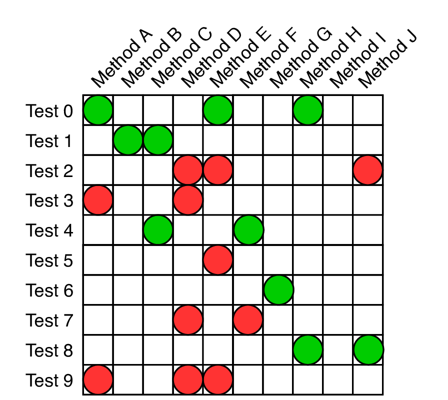
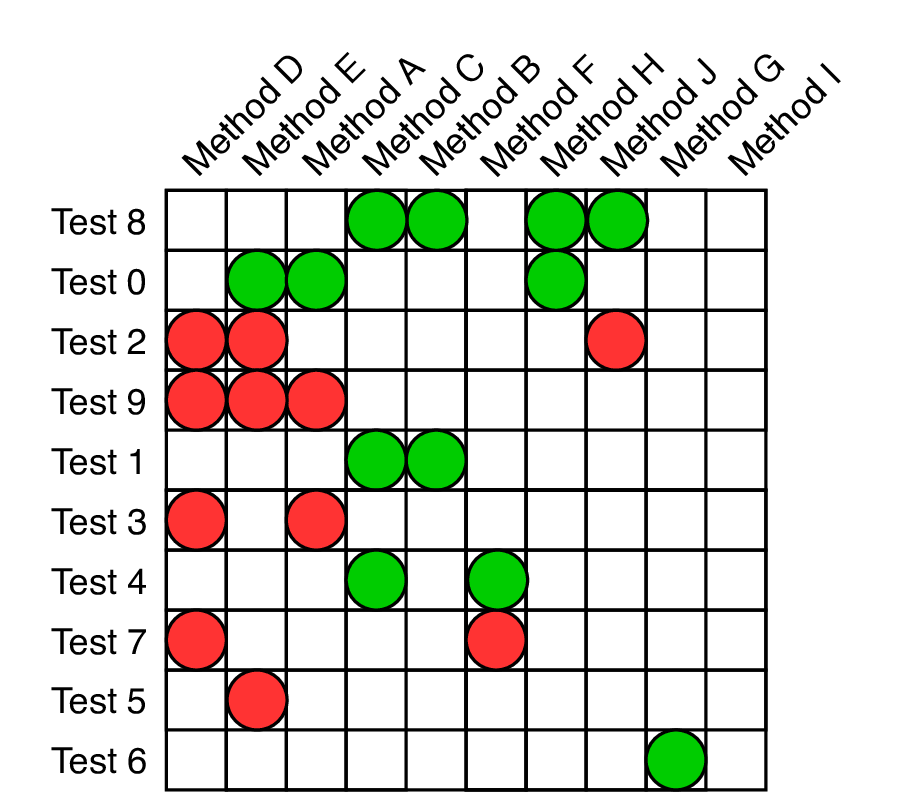
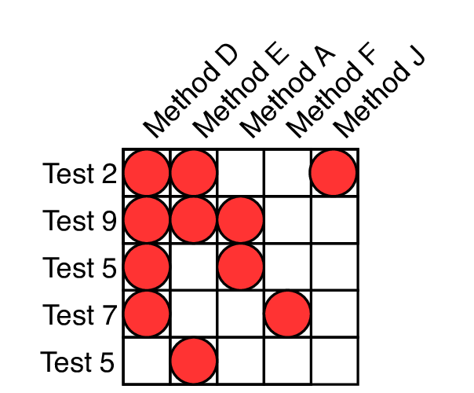
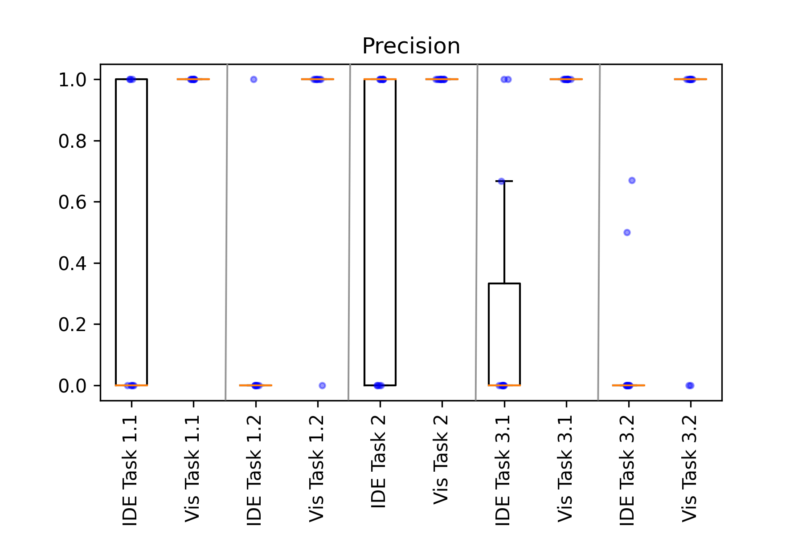
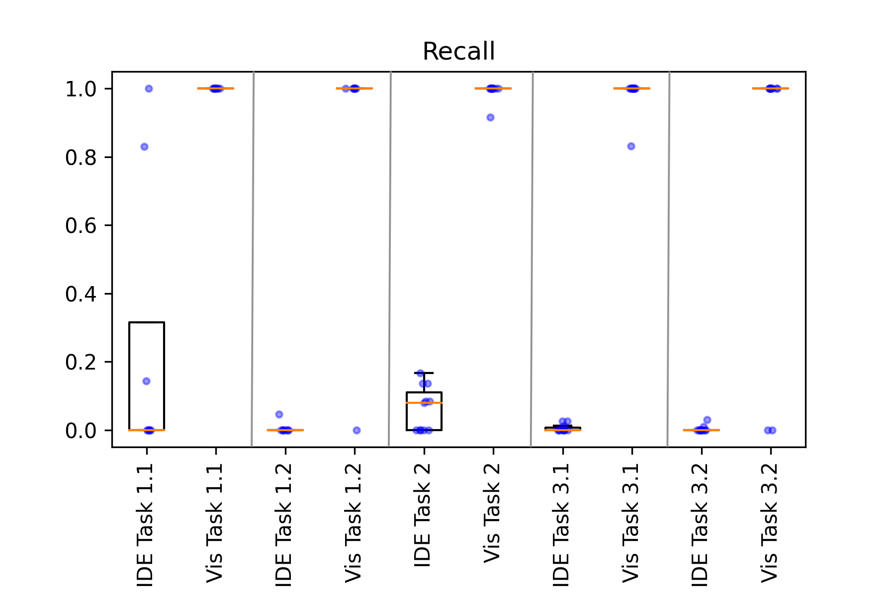

name: inverse
class: center, middle, inverse
layout: true
---

# **Morpheus**
## *Visualizing Form and Function of Test Suites*

#### Kaj Dreef

???

---
layout: false

# Outline
1. Introduction
2. Challenges
2. Morpheus Visualization
3. Implementation
4. Evaluation
5. Results 
6. Discussion
7. Conclusion

???

---
template: inverse

# Introduction

---

## Introduction

- Test suite should be an asset:
  - Which components are tested?
  - Which components remain untested or under-tested?
  - Which methods are covered when a test is failing?
  - etc.

--

<!-- Current state -->
- **Current state**: Integrated Development Environment
  - Local 
  - Global (test suite covers all these lines, but not by which test, or easy traceability)

--

<!-- Our solution -->
- Solution: Form and Function:
  - our goal:

---
template: inverse

# Challenges

---

## Challenges

- Challenge 1: Large test Suites with many tests
  <!-- - Traceability between test and production code -->

- Challenge 2: Maintaining test suites
  <!-- - Types of tests
  - Gaps in test suite -->

- Challenge 3: Tools with local views offer inadequate comprehension

???

---

template: inverse

# Morpheus Visualization

---

.left-column[
## Morpheus Visualization
#### Rows & Columns

]
.right-column[
- Test Matrix

  - **Columns**: Methods
  - **Rows**: Tests
  - **Intersection**: if test covers a method or not

]

---
count:false

.left-column[
## Morpheus Visualization
#### Rows & Columns

]
.right-column[
- Test Matrix

  - **Columns**: Methods
  - **Rows**: Tests
  - **Intersection**: if test covers a method or not

- Allow each dimension to be parameterized to represent other artifacts, e.g.,:
  - Individual source-code lines
  - Methods
  - Commits
  - etc.
]

---

.left-column[
## Morpheus Visualization
#### Rows & Columns

]
.right-column[
  </img>
]

---

.left-column[
## Morpheus Visualization
#### Rows & Columns
#### Color

]
.right-column[
- Used to convey additional information regarding:
  - Relation between individual artifacts on a single axis
  
      - e.g., all tests within the same package 
  
  - Relation between axes

      - e.g., failing of a test and which methods were covered.
]

---

.left-column[
## Morpheus Visualization
#### Rows & Columns
#### Color

]
.right-column[
  </img>
]

---

.left-column[
## Morpheus Visualization
#### Rows & Columns
#### Color
#### Sort

]
.right-column[
- Artifacts within a project are normally not isolated

- Goal: Juxtaposes artifacts that are related to each other.

- Types of sorting:
  - Sorting tests and production artifacts based on their directory path and filenames
  - Clustering production artifacts that are tested together;
  - Sorting tests and code components by metrics such as coverage and suspiciousness, respectively
]

---

.left-column[
## Morpheus Visualization
#### Rows & Columns
#### Color
#### Sort

]
.right-column[
  </img>
]

---

.left-column[
## Morpheus Visualization
#### Rows & Columns
#### Color
#### Sort
#### Filter

]
.right-column[
- Focussed view of a subset of the test matrix..

- Goal: Filter down to aid in improved comprehension of a project's test suite.

- Type of filters:
  - filter based on test type, e.g., unit, integration, system test;
  - filter based on test result;
  - filter based on coverage.
]

---

.left-column[
## Morpheus Visualization
#### Rows & Columns
#### Color
#### Sort
#### Filter

]
.right-column[
  </img>
]

---

template: inverse

# Implementation

---

.left-column[
## Implementation
#### Data Collection

]
.right-column[
1. Clone the project

2. Create Build environment

3. Run analysis
  1. Compile and test system to obtain per-test-case line coverage
  2. Parse system to obtain line method ranges.

  </img>
]

---

.left-column[
## Implementation
#### Data Collection
#### Architecture
]
.right-column[
     
  </img>
]

---

.left-column[
## Implementation
#### Data Collection
#### Architecture
#### Visualization
]
.right-column[
     
  </img>
]

---

template: inverse

# Evaluation

---

.left-column[
## Evaluation
#### Research Questions
]
.right-column[
    
- **RQ1**: Can the visualization provide insights into the *composition* of the test suite?

- **RQ2**: Can the visualization provide *traceability* between test and production code?

- **RQ3**: Can the visualization help identify sets of methods that fail together (i.e., executed by the same failing test cases)?

]

---

.left-column[
## Evaluation
#### Research Questions
#### User Study
]
.right-column[
- Three tasks:
  1. Distinguish different types of tests covering a specific method
      - Locate all unit tests covering that method
      - Locate all integration tests covering that method
  2. Locate all tests that cover a specific method
  3. Locate all methods that are co-failing within a specific method

- Two rounds (where all tasks were performed on commons-cli)
  - Round 1: Participants development environment (showed how to  and run tests and obtain test coverage).
  - Round 2: Only the visualization
]

---

template: inverse

# Results

---

.left-column[
## Results
#### Precision
]
.right-column[
  
###### higher precision is better.
]

---

.left-column[
## Results
#### Precision
#### Recall
]
.right-column[

###### higher recall is better.
]

---

.left-column[
## Results
#### Precision
#### Recall
#### Timing
]
.right-column[

###### less time is better.
]

---

template: inverse

# Discussion

---

## Discussion

- Challenge 1: Large test suites with many tests

  - Traceability between tests and methods, with a high precision and recall

  - Furthermore, given a method, Morpheus can show which methods it is co-executed with.
--

- Challenge 2: Maintaining test suites

  - Locating types of tests (covering a specific method) is considerably faster using the visualization

  - IDE is able to locate correct a small subset of unit tests, but low recall.
--

- Challenge 3: Tools with local views offer inadequate comprehension

  - Morpheus is able to accurately identify which methods fail together, allowing developers to step outside of just a local view.

---

template: inverse

# Demo
[<a href="http://morpheus.kajdreef.com/visualization" target="_blank">morpheus demo</a>]

---

template: inverse

# Conclusion

---

## Conclusion

- The visualization *Morpheus* provides:
  1. Global overview of all test cases and the methods they cover

  2. Local view by filtering to specific tests or methods of interest

  3. Juxtapose methods and tests through sorting

- The evaluation shows developers were better equipped using the visualization to answer questions regarding traceability between tests and methods, in terms of:
  - Accuracy

  - Time

  - (and also satisfaction with tool set)

---

## Questions?

  
  
  
  

---
count:false

template: inverse
# Extra slides

---
count:false

## F-Score

---
count:false

## Tool Satisfaction

---
count:false

## Commons-CLI

---
count:false

## Commons-IO

---
count:false

## Maven

---
count:false

## JSoup

---
count:false
## Clustering

---
count:false
## Case study 1: Test Suite Composition

---
count:false
## Case study 2: Test Failure Comprehension

---
count:false
## Case study 3: Inter-Project Test Suite Patterns

---
count:false
## Matrix vs Node-Link visualizations

- Node-Link has several downsides:

  1. it deals poorly with dense networks;

  2. requires aggregation methods or a good layout to reduce the density to be readable.
