name: inverse
class: center, middle, inverse
layout: true
---

<!-- # **Morpheus** -->
# Visualizing Form and Function of Test Suites

#### Kaj Dreef

???

---
layout: false

# Outline
1. Introduction
2. Challenges
2. Morpheus Visualization
3. Implementation
4. Evaluation
5. Results 
6. Discussion
7. Conclusion

???

---
template: inverse

# Introduction

---

## Introduction

- Testing is important

- Comprehending the test suite is important

- Traditional tools provide challenges to comprehension

<!-- - Questions a developer might ask:
    - What types of tests are available in the test suite?
    - Which components remain untested or under-tested?
    - What is a specific test covering?
    - Which test cases cover a specific (set of) method(s)?
    - Which methods are covered when a test is failing? -->
???

- Testing important:
  - Verify product behavior
  - Verify correctness by establishing a test oracle

- Test suite provides valuable information regarding how a system is expected to behave.

- Comprehending the test suite aids in better understanding your system.

- Test-suite development and maintenance is difficult, particularly when comprehension is limited

- Traditional tools provide challenges to comprehension, which presents an opportunity to improve
---

## Motivating scenario
    
> A developer wants to refactor an existing method. Before starting, the developer is interested in determining which tests are covering this method to assure that the refactoring will not cause any regression.

---

## Comprehension: Form & Function

 
> **Form**: Global overview of the composition of the test suite.

 

> **Function**: Local view or the behavior the test is testing for.  

???

Form = Composition of the test suite
  - unit, integration, system tests
  - What is covered and not covered by the tests

The “function” of a test deals with the specific desired behavior that the test is testing for, and the specific components and methods that it executes when doing so.

- However, test suite comprehension brings its own unique set of challenges... (next slide)

---
template: inverse

# Challenges

---

## Challenges

- Challenge 1: Large test suites with many tests

- Challenge 2: Maintaining test suites
  
- Challenge 3: Tools with local views offer inadequate comprehension

???

- Challenge 1:
  - Traceability between test and production code

- Challenge 2:
  - Types of tests
  - Gaps in test suite

- Challenge 3:
  - 
---

template: inverse

# Morpheus Visualization

---

.left-column[
## Morpheus Visualization
#### Rows & Columns

]
.right-column[
 
 

  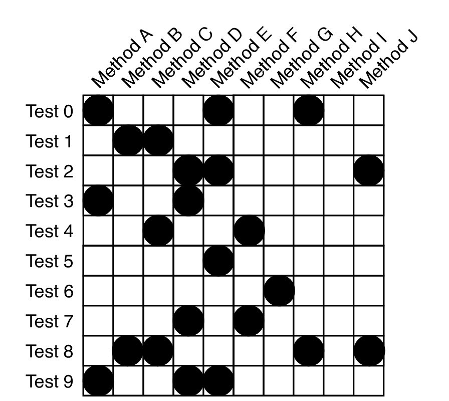</img>

 
 
<ul>
  <li>Test Matrix </li>
  <ul>
    <li> <b>Columns</b>: Methods </li>
    <li> <b>Rows</b>: Tests </li>
    <li> <b>Intersection</b>: Method covered or not </li>
  </ul>
  <li>Each dimension is configurable:</li>
  <ul>
  <li> Individual source-code lines</li>
  <li> Methods</li>
  <li> Commits</li>
  </ul>

]

---
count: false
.left-column[
## Morpheus Visualization
#### Rows & Columns

]
.right-column[
 
 

  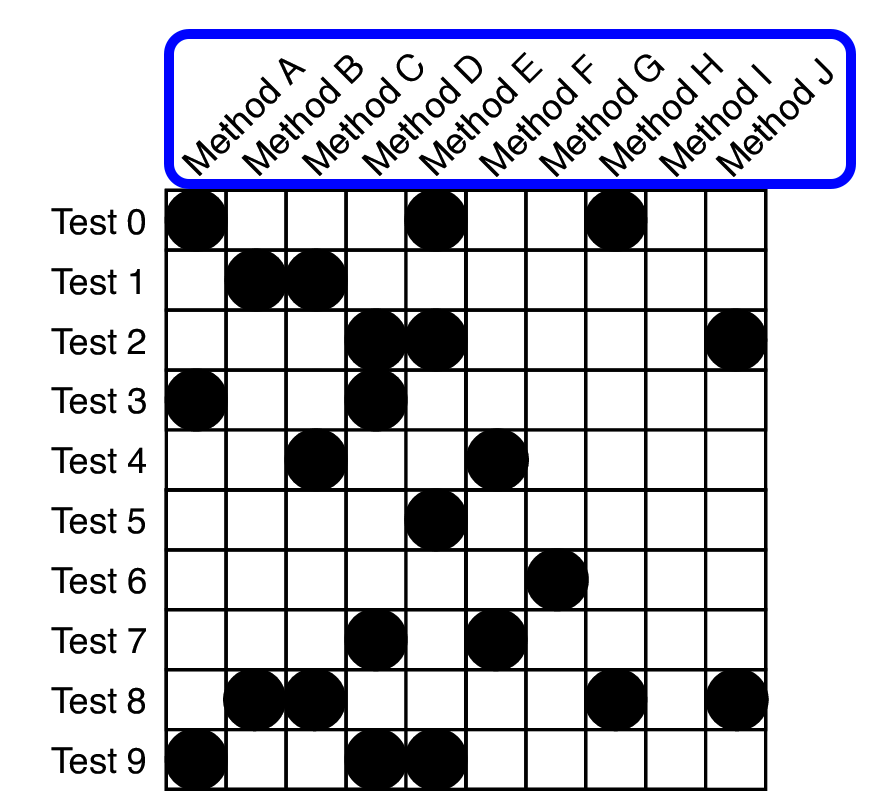</img>

 
 
<ul>
  <li>Test Matrix </li>
  <ul>
    <li> <b>Columns</b>: Methods </li>
    <li> <b>Rows</b>: Tests </li>
    <li> <b>Intersection</b>: Method covered or not </li>
  </ul>
  <li>Each dimension is configurable:</li>
  <ul>
  <li> Individual source-code lines</li>
  <li> Methods</li>
  <li> Commits</li>
  </ul>

]

---
count: false
.left-column[
## Morpheus Visualization
#### Rows & Columns

]
.right-column[
 
 

  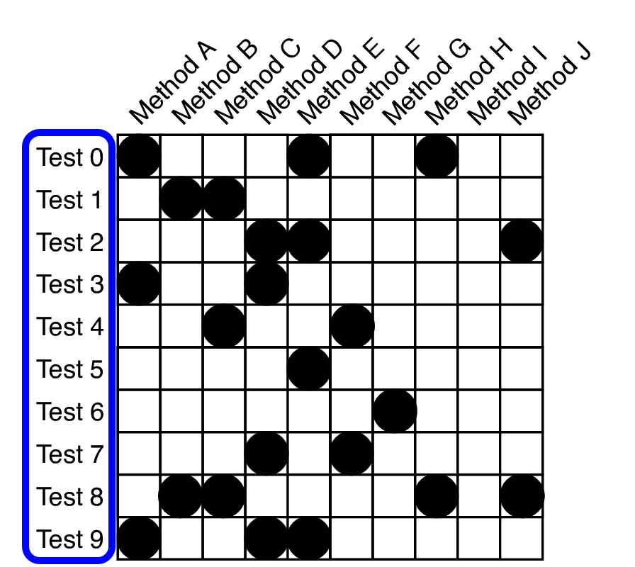</img>

 
 
<ul>
  <li>Test Matrix </li>
  <ul>
    <li> <b>Columns</b>: Methods </li>
    <li> <b>Rows</b>: Tests </li>
    <li> <b>Intersection</b>: Method covered or not </li>
  </ul>
  <li>Each dimension is configurable:</li>
  <ul>
  <li> Individual source-code lines</li>
  <li> Methods</li>
  <li> Commits</li>
  </ul>

]

---
count: false
.left-column[
## Morpheus Visualization
#### Rows & Columns

]
.right-column[
 
 

  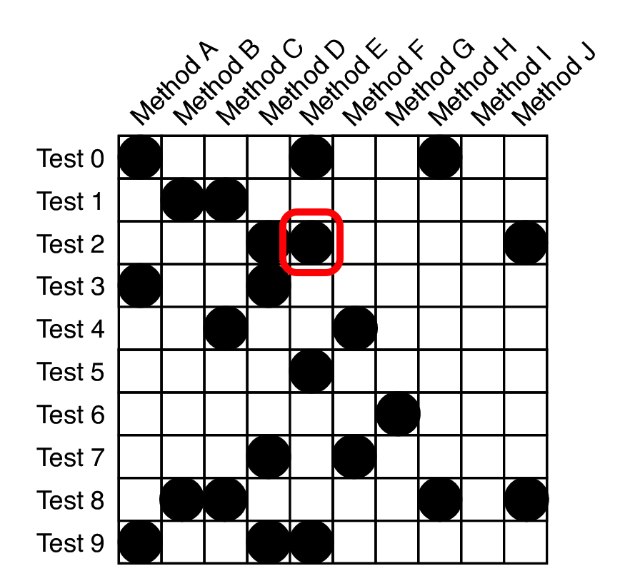</img>

 
 
<ul>
  <li>Test Matrix </li>
  <ul>
    <li> <b>Columns</b>: Methods </li>
    <li> <b>Rows</b>: Tests </li>
    <li> <b>Intersection</b>: Method covered or not </li>
  </ul>
  <li>Each dimension is configurable:</li>
  <ul>
  <li> Individual source-code lines</li>
  <li> Methods</li>
  <li> Commits</li>
  </ul>

]

---
count: false
.left-column[
## Morpheus Visualization
#### Rows & Columns

]
.right-column[
 
 

  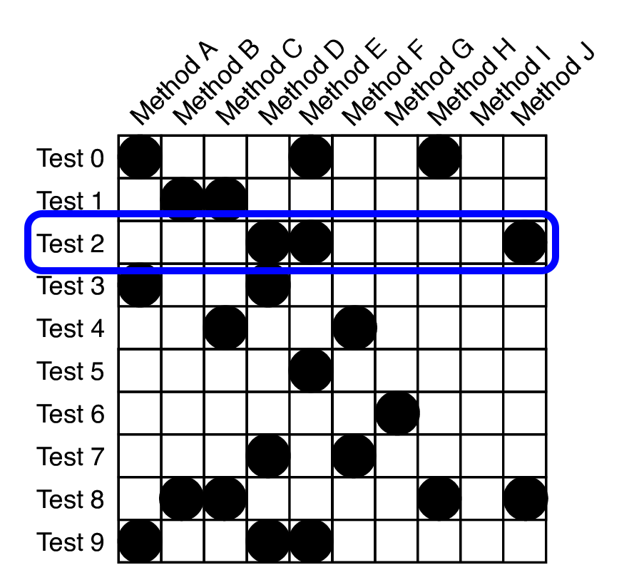</img>

 
 
<ul>
  <li>Test Matrix </li>
  <ul>
    <li> <b>Columns</b>: Methods </li>
    <li> <b>Rows</b>: Tests </li>
    <li> <b>Intersection</b>: Method covered or not </li>
  </ul>
  <li>Each dimension is configurable:</li>
  <ul>
  <li> Individual source-code lines</li>
  <li> Methods</li>
  <li> Commits</li>
  </ul>

]

---
count: false
.left-column[
## Morpheus Visualization
#### Rows & Columns

]
.right-column[
 
 

  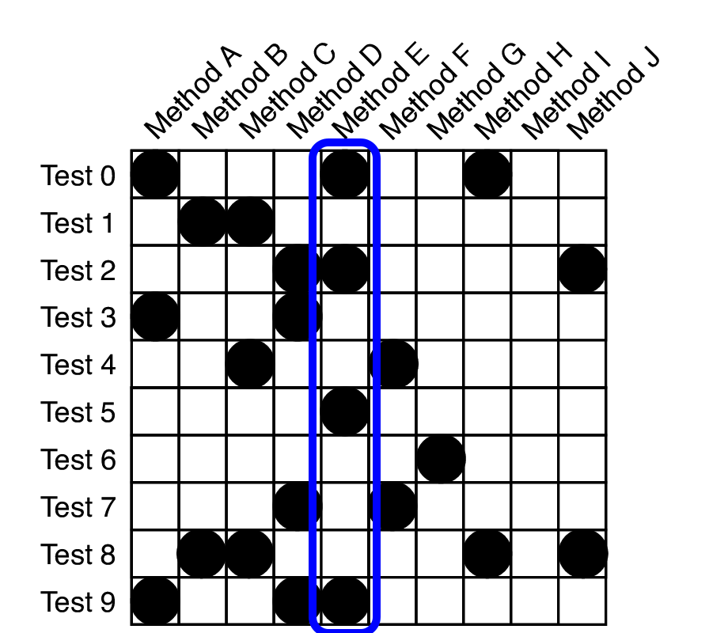</img>

 
 
<ul>
  <li>Test Matrix </li>
  <ul>
    <li> <b>Columns</b>: Methods </li>
    <li> <b>Rows</b>: Tests </li>
    <li> <b>Intersection</b>: Method covered or not </li>
  </ul>
  <li>Each dimension is configurable:</li>
  <ul>
  <li> Individual source-code lines</li>
  <li> Methods</li>
  <li> Commits</li>
  </ul>

]

---

.left-column[
## Morpheus Visualization
#### Rows & Columns
#### Color

]
.right-column[
 
 

  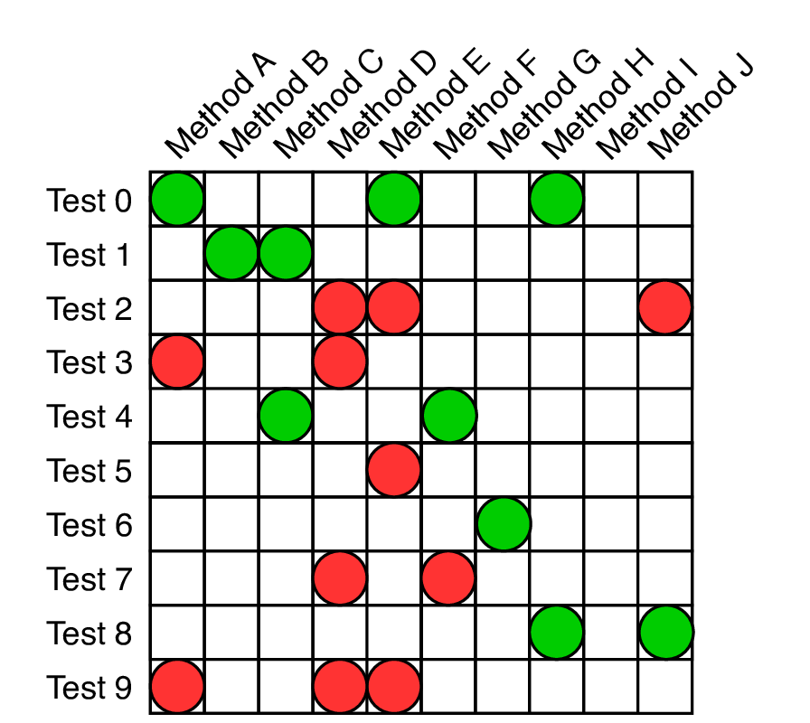</img>

 
 
<ul>
  <li>Color can be used to show:</li>
  <ul>
    <li> Pass fail status </li>
    <li> Package composition </li>
    <li> Suspiciousness </li>
  </ul>

]

---
count:false
.left-column[
## Morpheus Visualization
#### Rows & Columns
#### Color

]
.right-column[
 
 

  </img>

 
 
<ul>
  <li>Color can be used to show:</li>
  <ul>
    <li> Pass fail status </li>
    <li> Package composition </li>
    <li> Suspiciousness </li>
  </ul>

]

---
count:false
.left-column[
## Morpheus Visualization
#### Rows & Columns
#### Color

]
.right-column[
 
 

  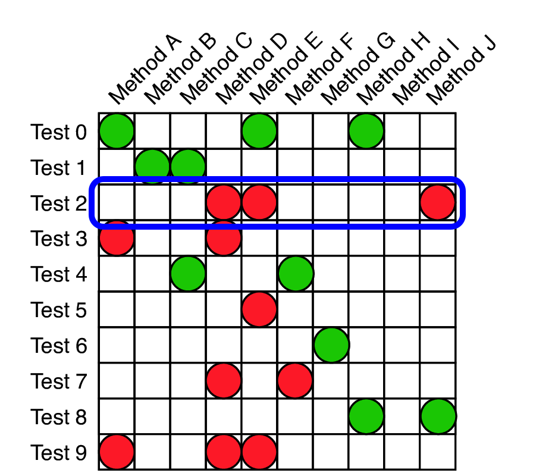</img>

 
 
<ul>
  <li>Color can be used to show:</li>
  <ul>
    <li> Pass fail status </li>
    <li> Package composition </li>
    <li> Suspiciousness </li>
  </ul>

]

---

.left-column[
## Morpheus Visualization
#### Rows & Columns
#### Color
#### Sort

]
.right-column[
 
 

  </img>

 
 
<ul>
  <li>Sorting based on:</li>
  <ul>
    <li> Directory path and filenames </li>
    <li> Coverage </li>
    <li> suspiciousness </li>
  </ul>

]

---
count:false

.left-column[
## Morpheus Visualization
#### Rows & Columns
#### Color
#### Sort

]
.right-column[
 
 

  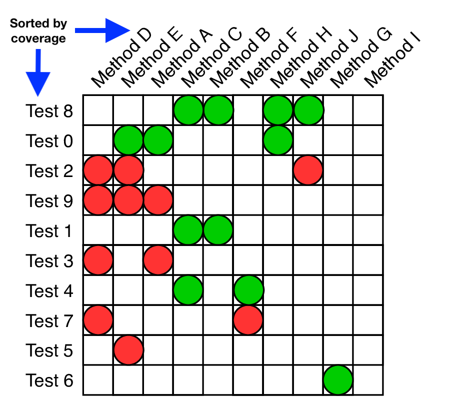</img>

 
 
<ul>
  <li>Sorting based on:</li>
  <ul>
    <li> Directory path and filenames </li>
    <li> Coverage </li>
    <li> suspiciousness </li>
  </ul>

]

???
- Artifacts within a project are normally not isolated

- Goal: Juxtaposes artifacts that are related to each other.

---

.left-column[
## Morpheus Visualization
#### Rows & Columns
#### Color
#### Sort
#### Filter

]
.right-column[
 
 

  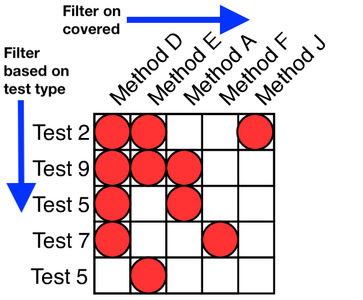</img>

 
 
<ul>
  <li>Filtering based on:</li>
  <ul>
    <li> Test type</li>
    <li> Test result </li>
    <li> Coverage </li>
  </ul>

]

???
- Focussed view of a subset of the test matrix..

- Goal: Filter down to aid in improved comprehension of a project's test suite.

- Type of filters:
  - filter based on test type, e.g., unit, integration, system test;
  - filter based on test result;
  - filter based on coverage.

---

template: inverse

# Implementation

---

.left-column[
## Implementation
#### Data Collection

]
.right-column[
1. Clone the project

2. Create Build environment

3. Run analysis
  1. Compile and test system to obtain per-test-case line coverage
  2. Parse system to obtain line method ranges.

  </img>
]

---
count:false
.left-column[
## Implementation
#### Data Collection

]
.right-column[
1. Clone the project

2. Create Build environment

3. Run analysis
  1. Compile and test system to obtain per-test-case line coverage
  2. Parse system to obtain line method ranges.

  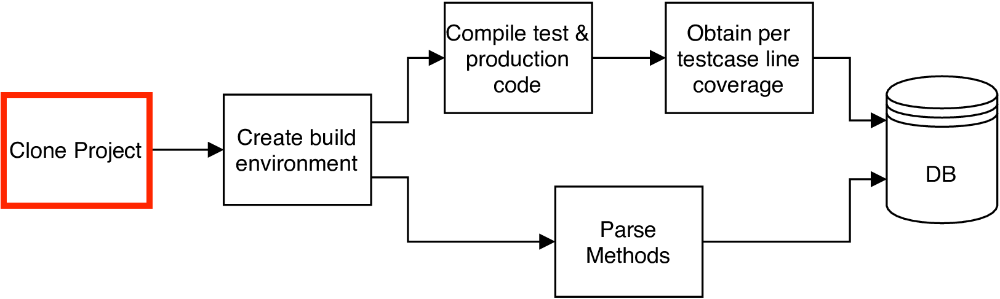</img>
]

---
count:false
.left-column[
## Implementation
#### Data Collection

]
.right-column[
1. Clone the project

2. Create Build environment

3. Run analysis
  1. Compile and test system to obtain per-test-case line coverage
  2. Parse system to obtain line method ranges.

  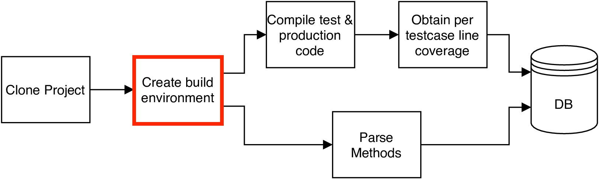</img>
]

---
count:false
.left-column[
## Implementation
#### Data Collection

]
.right-column[
1. Clone the project

2. Create Build environment

3. Run analysis
  1. Compile and test system to obtain per-test-case line coverage
  2. Parse system to obtain line method ranges.

  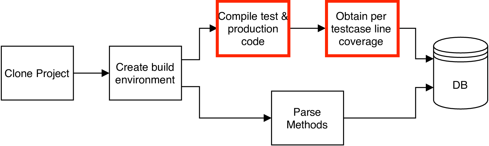</img>
]

---
count:false
.left-column[
## Implementation
#### Data Collection

]
.right-column[
1. Clone the project

2. Create Build environment

3. Run analysis
  1. Compile and test system to obtain per-test-case line coverage
  2. Parse system to obtain line method ranges.

  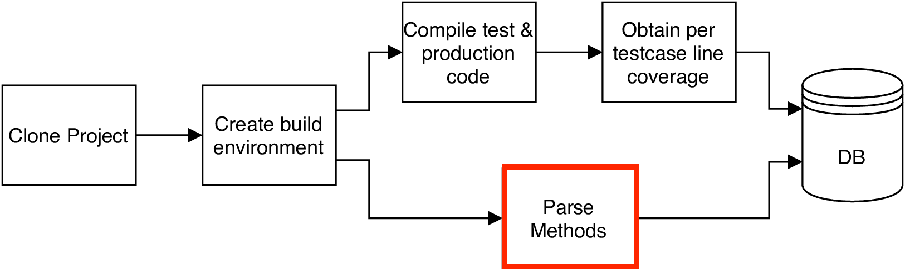</img>
]

---

.left-column[
## Implementation
#### Data Collection
#### Architecture
]
.right-column[
     
  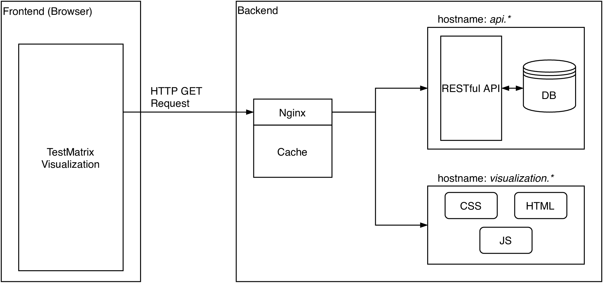</img>
]

???

- Web Application, with a client server architecture
- For the sake of time I will skip over this for now, but feel free to ask questions later.

---

.left-column[
## Implementation
#### Data Collection
#### Architecture
#### Visualization
]
.right-column[
   
  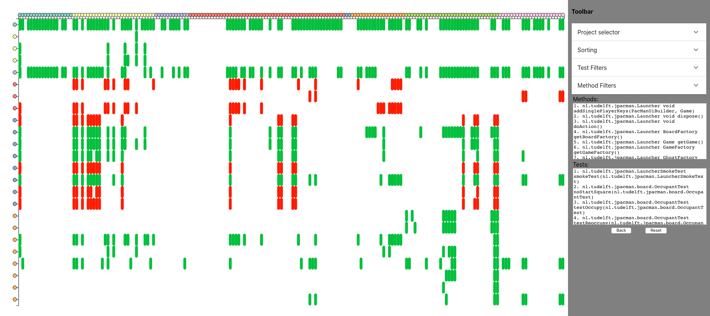</img>
  .center[
    [<a href="http://morpheus.kajdreef.com/visualization" target="_blank">morpheus demo</a>]
  ]
]

---

template: inverse

# Evaluation

---

.left-column[
## Evaluation
#### Research Questions
]
.right-column[
  

- **RQ1**: Can the visualization provide insights into the *composition* of the test suite?

- **RQ2**: Can the visualization provide *traceability* between test and production code?

- **RQ3**: Can the visualization help identify sets of methods that fail together (i.e., executed by the same failing test cases)?

]

---

.left-column[
## Evaluation
#### Research Questions
#### User Study
]
.right-column[
- Three tasks:
  1. Identify all unit and integration tests for method A.
  2. Locate all tests that cover a specific method
  3. Locate all methods that are co-failing within a specific method

- Two rounds:
  - Round 1: Participants development environment 
  - Round 2: Only the visualization

]

???

- All tasks performed on the same project, commons-cli

- 11 Participants, a group consisting of:
  - 9 SE graduate students
  - 1 SE undergrad
  - 1 Software Test Engineer

---

template: inverse

# Results

---

.left-column[
## Results
#### Precision
]
.right-column[
  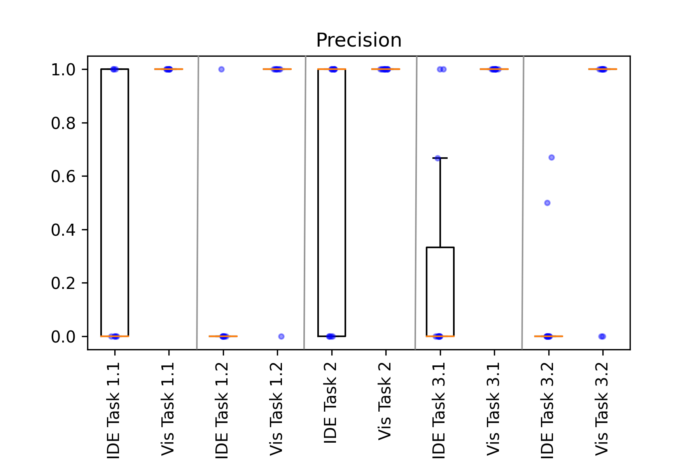
  .center[
    ###### higher precision is better.
  ]
]

---
count:false
.left-column[
## Results
#### Precision
]
.right-column[
  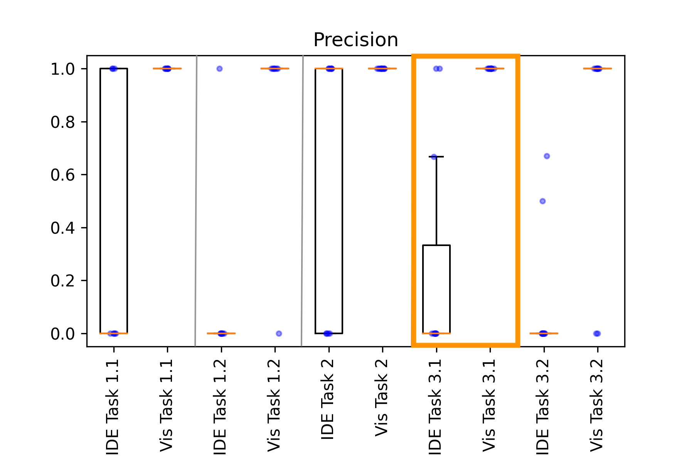
  .center[
    ###### higher precision is better.
  ]
]

???
- red line represents the median
- Task 2:
  - same medians
  - big variance.
- Precision: Ratio of *all* selected methods and those are correct.

---
count:false
.left-column[
## Results
#### Precision
]
.right-column[
  
  .center[
    ###### higher precision is better.
  ]
]

.summary[
  ### Visualization has a higher precision than the IDE  in 4 out 5 tasks.
]

---

.left-column[
## Results
#### Precision
#### Recall
]
.right-column[
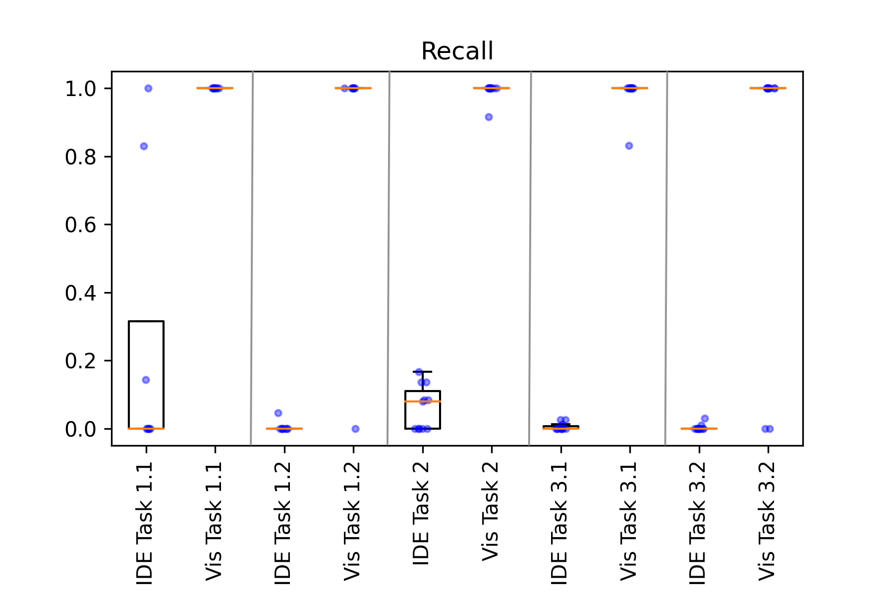
  .center[
    ###### higher recall is better.
  ]
]

---
count:false
.left-column[
## Results
#### Precision
#### Recall
]
.right-column[

  .center[
    ###### higher recall is better.
  ]
]

???
- Recall: Ratio of *all* selected methods and all relevant methods.

---
count:false
.left-column[
## Results
#### Precision
#### Recall
]
.right-column[

  .center[
    ###### higher recall is better.
  ]
]

.summary[
  ### Visualization has a higher recall than the IDE  in in all tasks.
]

---

.left-column[
## Results
#### Precision
#### Recall
#### Timing
]
.right-column[
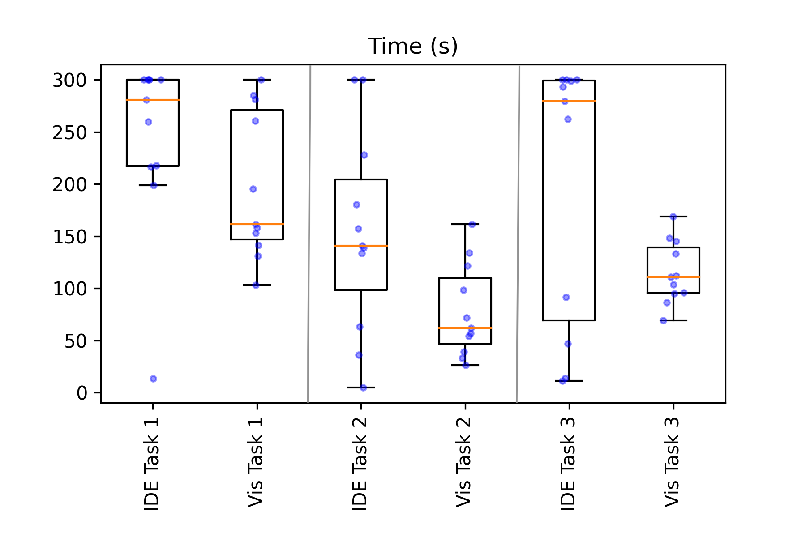
  .center[
    ###### less time is better.
  ]
]

---
count:false
.left-column[
## Results
#### Precision
#### Recall
#### Timing
]
.right-column[
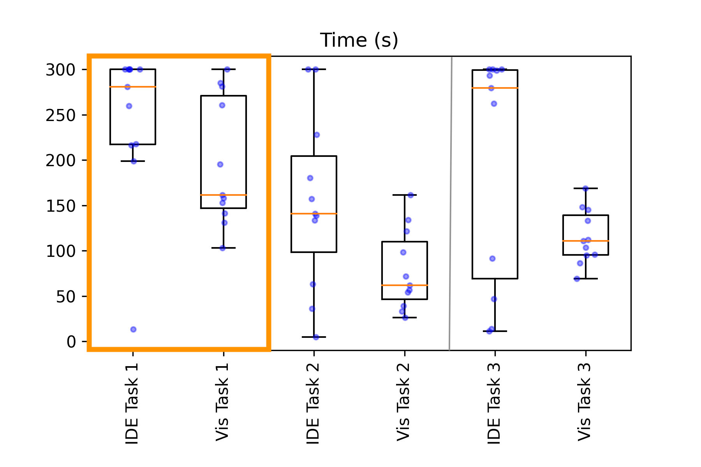
  .center[
    ###### less time is better.
  ]
]

???

- Task 1:
  - Deviation is smaller for the IDE
  - Median is in favor of the visualization

---
count:false
.left-column[
## Results
#### Precision
#### Recall
#### Timing
]
.right-column[

  .center[
    ###### less time is better.
  ]
]

.summary[
  ###  Participants using the visualization perform the tasks   on average faster than the IDE in all tasks.
]

???

- We see this happen for all the other tasks as well
- Median of visualization is lower than IDE
- Some outliers with IDE, however, it may be that some participant started to give up after Task 1.

---

template: inverse

# Discussion

---

## Discussion

- Challenge 1: Large test suites with many tests

  - Traceability between tests and methods
      - high precision
      - high recall
  - Co-execution of methods

???

- Traceability between tests and methods, with a high precision and recall

- Furthermore, given a method, Morpheus can show which methods it is co-executed with.

- Making it possible to locate the methods of interest

--

- Challenge 2: Maintaining test suites

  - Locating types of tests

  - IDE is able to locate correct a small subset of unit tests, but low recall.

???

- Locating types of tests covering a specific method becomes possible with visualization

- IDE is difficult and everything becomes a ``unit`` test

- Visualization is faster than using the IDE

--

- Challenge 3: Tools with local views offer inadequate comprehension

  - Identify co-failing methods

???

- Morpheus is able to accurately identify which methods fail together, allowing developers to step outside of just a local view.

- IDE is capable of doing some of these tasks
  - Very poor recall
  - Only tests that directly invoke the given method are easy to find

---

template: inverse

# Conclusion

---

## Conclusion

- The visualization *Morpheus* provides:
  1. Global overview of test suite

  2. Local view by filtering to specific tests or methods

  3. Juxtaposition of data via sorting

- Developers using *morpheus* are better equipped in answering questions about a test suite.

???

- Global overview of all test cases and the methods they cover

- Local view by filtering to specific tests or methods

- On top of that, we can sort and filter based on properties of the tests or methods to uncover patterns.

- The evaluation shows developers were better equipped using the visualization to answer questions regarding traceability between tests and methods, in terms of precision, recall, time, and also satisfaction with the tool set

---

## Questions?

  
  
  
  

---
count:false

template: inverse
# Extra slides

---
count:false

## F-Score

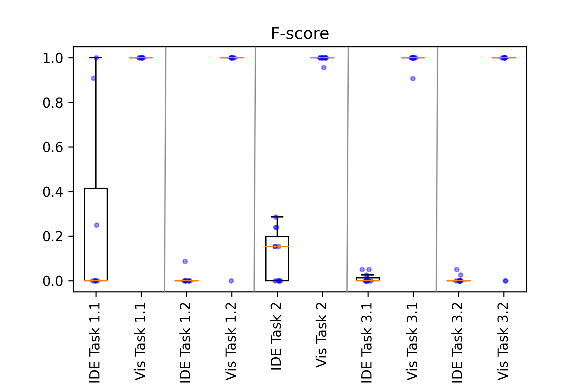

---
count:false

## Tool Satisfaction

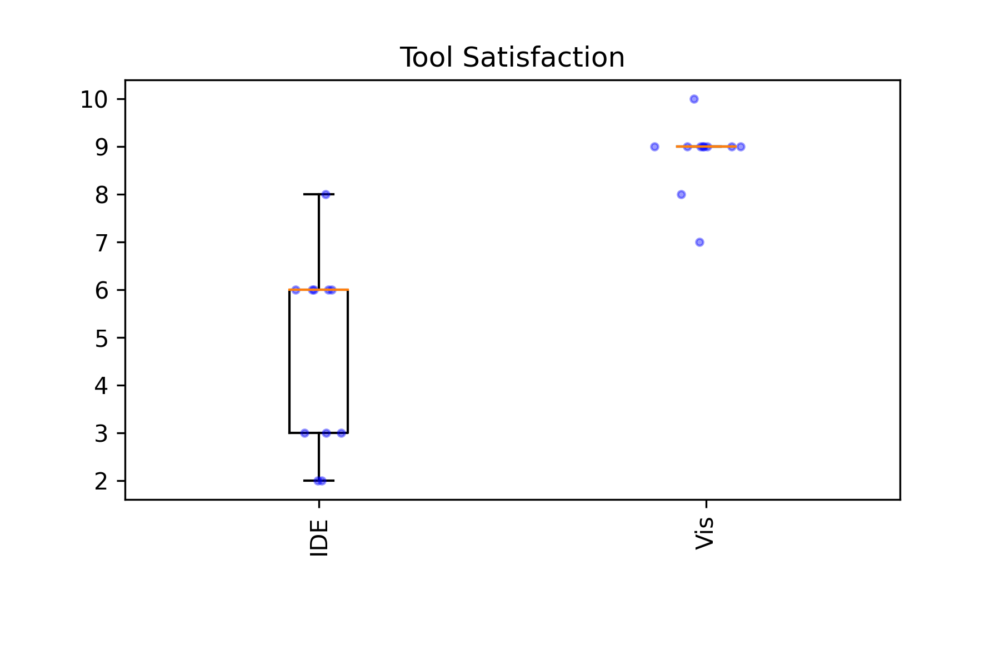

---
count:false

## Commons-CLI

---
count:false

## Commons-IO

---
count:false

## Maven

---
count:false

## JSoup

---
count:false
## Clustering

---
count:false
## Case study 1: Test Suite Composition

---
count:false
## Case study 2: Test Failure Comprehension

---
count:false
## Case study 3: Inter-Project Test Suite Patterns

---
count:false
## Matrix vs Node-Link visualizations

- Node-Link has several downsides:

  1. it deals poorly with dense networks;

  2. requires aggregation methods or a good layout to reduce the density to be readable.
