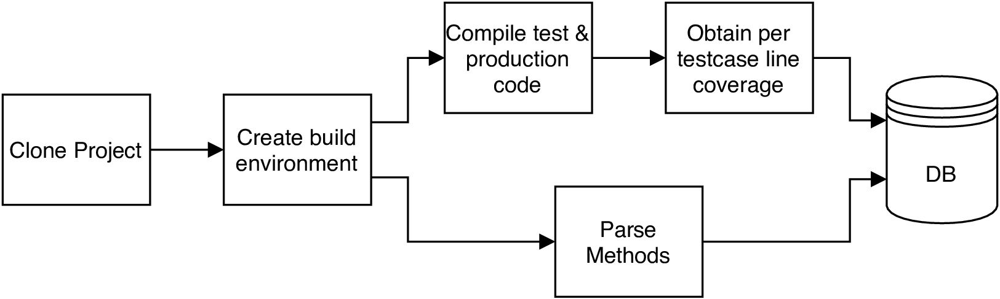

name: inverse
class: center, middle, inverse
layout: true
---

# **Morpheus**
## *Visualizing Form and Function of Test Suites*

#### Kaj Dreef

???

---
layout: false

# Outline
1. Problem and Challenges
2. Morpheus Visualization
3. Implementation
4. Evaluation
5. Results 
6. Discussion
7. Conclusion

???

---
template: inverse

# Problem and Challenges

---

## Problem and Challenges

- Challenge 1: Large test Suites with many tests
  - Traceability between test and production code

- Challenge 2: Maintaining test suites
  - Types of tests
  - Gaps in test suite

- Challenge 3: Tools with local views offer inadequate comprehension

???

---

template: inverse

# Morpheus Visualization

---

.left-column[
## Morpheus Visualization
#### Rows & Columns

]
.right-column[
- **Test Matrix**
  - **Columns**: Methods
  - **Rows**: Tests
  - **Intersection**: if test covers a method or not

- Allow each dimension to be parameteritized to represent other artifacts, e.g.,:
  - Individual source-code lines
  - Methods
  - Commits
  - etc.
]

---

.left-column[
## Morpheus Visualization
#### Rows & Columns

]
.right-column[
  </img>
]

---

.left-column[
## Morpheus Visualization
#### Rows & Columns
#### Color

]
.right-column[
- Used to convey additional information regarding:
  - Relation between individual artifacts on a single axis
  
      - e.g., all tests within the same package 
  
  - Relation between axis

      - e.g., failing of a test and which methods were covered.
]

---

.left-column[
## Morpheus Visualization
#### Rows & Columns
#### Color

]
.right-column[
  </img>
]

---

.left-column[
## Morpheus Visualization
#### Rows & Columns
#### Color
#### Sort

]
.right-column[
- Artifacts within a project are normally not isolated

- Goal: Juxtaposes artifacts that are related to each other.

- Types of sorting:
  - Sorting tests and production artifacts based on their directory path and filenames
  - Clustering production artifacts that are tested together;
  - Sorting tests and code components by metrics such as coverage and suspiciousness, respectively
]

---

.left-column[
## Morpheus Visualization
#### Rows & Columns
#### Color
#### Sort

]
.right-column[
  </img>
]

---

.left-column[
## Morpheus Visualization
#### Rows & Columns
#### Color
#### Sort
#### Filter

]
.right-column[
- Focussed view of a subset of the test matrix..

- Goal: Filter down to aid in improved comprehension of a project's test suite.

- Type of filters:
  - filter based on test type, e.g., unit, integration, system test;
  - filter based on test result;
  - filter based on coverage.
]

---

.left-column[
## Morpheus Visualization
#### Rows & Columns
#### Color
#### Sort
#### Filter

]
.right-column[
  </img>
]

---

template: inverse

# Implementation

---

.left-column[
## Implementation
#### Data Collection

]
.right-column[
1. Clone the project

2. Create Build environment

3. Run analysis
  1. Compile and test system to obtain per-test-case line coverage
  2. Parse system to obtain line method ranges.

  </img>
]

---

.left-column[
## Implementation
#### Data Collection
#### Architecture
]
.right-column[
  </img>
]

---

.left-column[
## Implementation
#### Data Collection
#### Architecture
#### Visualization
]
.right-column[
     
  </img>
]

---

template: inverse

# Evaluation

---

.left-column[
## Evaluation
#### Case Studies
]
.right-column[

]

---

.left-column[
## Evaluation
#### Case Studies
#### User Study
]
.right-column[

]

---

template: inverse

# Results

---

template: inverse

# Discussion

---

template: inverse

# Conclusion

