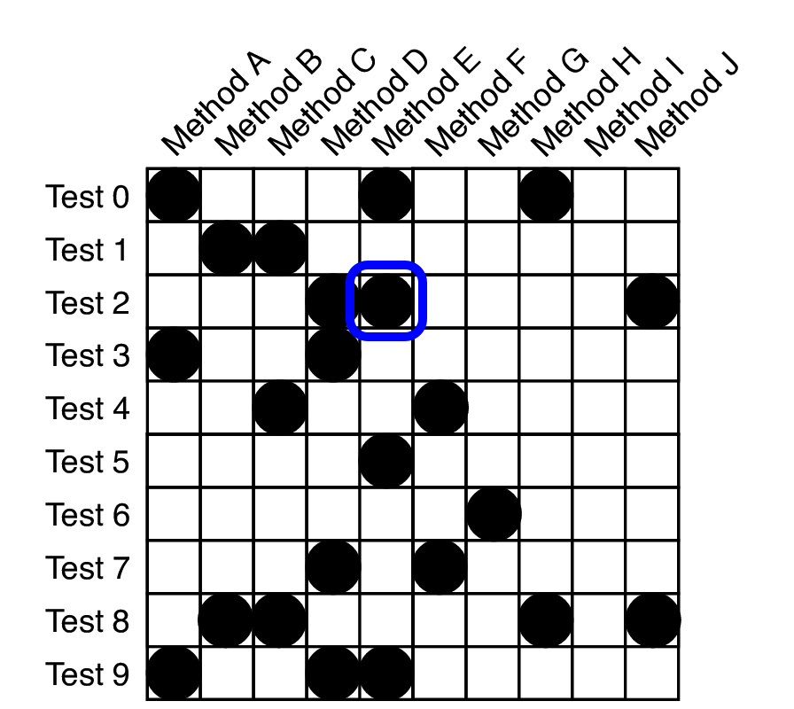
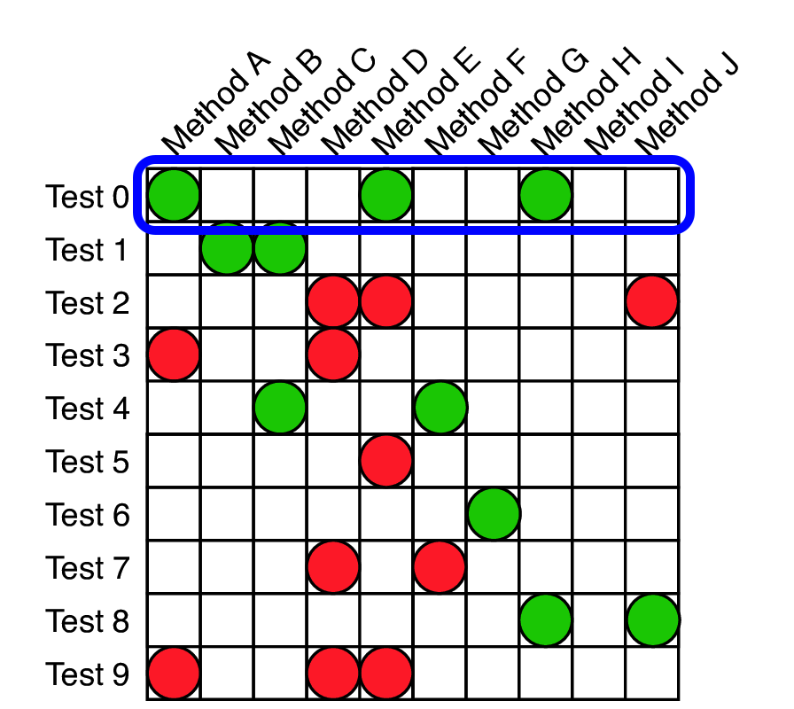
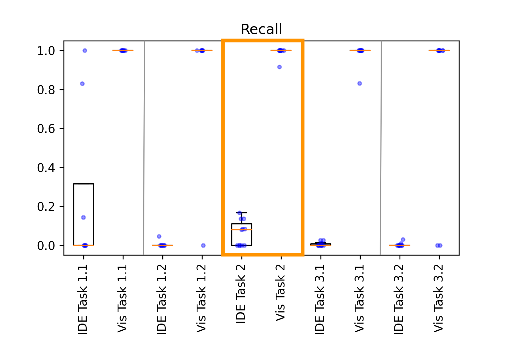

name: inverse
class: center, middle, inverse
layout: true
---

<!-- # **Morpheus** -->
# Visualizing Form and Function of Test Suites

#### Kaj Dreef

???
- Good afternoon, thank you for attending my master defense.

- The topic of today will be Visualizing form and function of test suites.

---
layout: false

# Outline
1. Introduction
2. Challenges
2. Morpheus Visualization
3. Demo
4. User Study
5. Results 
6. Discussion
7. Conclusion

???

- The outline of today will be:
  1. Introduction
  2. Challenges
  2. Morpheus Visualization
  3. Demo
  4. User Study
  5. Results 
  6. Discussion
  7. Conclusion

---
template: inverse

# Introduction

---

## Why Do We Care about Software Test Comprehension?

- Testing is important

- Comprehending the test suite is important

- Traditional tools provide challenges to comprehension

<!-- - Questions a developer might ask:
    - What types of tests are available in the test suite?
    - Which components remain untested or under-tested?
    - What is a specific test covering?
    - Which test cases cover a specific (set of) method(s)?
    - Which methods are covered when a test is failing? -->
???

- Testing important:
  - It allows developers to **verify product behavior**.
  - and, **by establishing a test oracle, verify correctness**

- Test suite provides valuable information regarding how a system is expected to behave.
  - As a result, the test suite can aid in better understanding your system.

<!-- - Test-suite development and maintenance is difficult, particularly when comprehension is limited -->

- Traditional tools provide challenges to comprehension, due to giving only a local, *file-centric*, view, presenting an opportunity to improve.

---

## Software Test Comprehension: Form & Function

 
> **Form**: Global overview of the composition of the test suite.

 

> **Function**: Local view or the behavior the test is testing for.  

???

Form = Composition of the test suite
  - unit, integration, system tests
  - What is executed and not executed by the tests

The “function” of a test deals with the specific desired behavior that the test is testing for, and the specific components and methods that it executes when doing so.

- However, test suite comprehension brings its own unique set of challenges... (next slide)

---

##  Motivating Scenario (1): Refactoring a Method

- What kind of tests does this system have?
- Do existing tests execute this method?
    - What kind of tests are they?
- Did the tests execute the modified/new lines of code?

--

.left50[
- IDE 
  - Breakpoints
  - Logging
  - Assert statements
  - ...
]
.right50[
  .center[
  </img>
  </img>
  ]
]

???

- Manual process
- Time consuming
- Losing information

---

##  Motivating Scenario (2): Are Components A and B Tested Together?

- How many integration tests does the test suite have?
- Do any integration tests execute methods A and B?
- Are there any integration tests executing both A and B?

--

.left50[
- IDE 
  - Breakpoints
  - Logging
  - Assert statements
  - ...
]
.right50[
  .center[
  </img>
  </img>
  ]
]

???

- Breakpoints: manual and laborious
- Logging: can be overwhelming
- Assert statements: localized, method/file-centric views
- ...
---
template: inverse

# Challenges

---

## Test Comprehension Challenges

- Challenge 1: Large test suites with many tests

- Challenge 2: Maintaining test suites
  
- Challenge 3: Tools with local views offer inadequate comprehension

???

- Challenge 1:
  - Developers have difficulty figuring out which test cases execute what methods.
  - Lack of traceability between test and production code

- Challenge 2:
  - Developers have finite resources, and thus most time is spend on production code, leading to a loss in understanding of the form and function of the test suite.
  - For example:
    - what types of tests are available?
    - Gaps in test suite
  - Ultimately leading in uneven degrees of testing within the system.

- Challenge 3:
  - *IDE* often improve productivity of a developer, but they provide a *file-centric* view of of a project.
  - Not allowing developers to see each entity, for example a method, in context of how it is used and tested.
---

template: inverse

# Morpheus Visualization

---

.left-column[
## Morpheus Visualization
#### Rows & Columns

]
.right-column[
 
 

  </img>

 
 
<ul>
  <li>Test Matrix </li>
  <ul>
    <li> <b>Columns</b>: Methods </li>
    <li> <b>Rows</b>: Tests </li>
    <li> <b>Intersection</b>: Method executed or not </li>
  </ul>
  <li>Each dimension is configurable, e.g.,</li>
  <ul>
  <li> Individual source-code lines</li>
  <li> Methods</li>
  <li> Commits</li>
  </ul>

]

???

- Test Matrix Visualization

---
count: false
.left-column[
## Morpheus Visualization
#### Rows & Columns

]
.right-column[
 
 

  </img>

 
 
<ul>
  <li>Test Matrix </li>
  <ul>
    <li> <b>Columns</b>: Methods </li>
    <li> <b>Rows</b>: Tests </li>
    <li> <b>Intersection</b>: Method executed or not </li>
  </ul>
  <li>Each dimension is configurable, e.g.,</li>
  <ul>
  <li> Individual source-code lines</li>
  <li> Methods</li>
  <li> Commits</li>
  </ul>

]

???

- Columns represent the methods

---
count: false
.left-column[
## Morpheus Visualization
#### Rows & Columns

]
.right-column[
 
 

  </img>

 
 
<ul>
  <li>Test Matrix </li>
  <ul>
    <li> <b>Columns</b>: Methods </li>
    <li> <b>Rows</b>: Tests </li>
    <li> <b>Intersection</b>: Method executed or not </li>
  </ul>
  <li>Each dimension is configurable, e.g.,</li>
  <ul>
  <li> Individual source-code lines</li>
  <li> Methods</li>
  <li> Commits</li>
  </ul>

]

???

- Rows represent the test cases

---
count: false
.left-column[
## Morpheus Visualization
#### Rows & Columns

]
.right-column[
 
 

  </img>

 
 
<ul>
  <li>Test Matrix </li>
  <ul>
    <li> <b>Columns</b>: Methods </li>
    <li> <b>Rows</b>: Tests </li>
    <li> <b>Intersection</b>: Method executed or not </li>
  </ul>
  <li>Each dimension is configurable, e.g.,</li>
  <ul>
  <li> Individual source-code lines</li>
  <li> Methods</li>
  <li> Commits</li>
  </ul>

]
???

- On the intersection, I present if a method was executed by the test or not.

---
count: false
.left-column[
## Morpheus Visualization
#### Rows & Columns

]
.right-column[
 
 

  </img>

 
 
<ul>
  <li>Test Matrix </li>
  <ul>
    <li> <b>Columns</b>: Methods </li>
    <li> <b>Rows</b>: Tests </li>
    <li> <b>Intersection</b>: Method executed or not </li>
  </ul>
  <li>Each dimension is configurable, e.g.,</li>
  <ul>
  <li> Individual source-code lines</li>
  <li> Methods</li>
  <li> Commits</li>
  </ul>

]
???

- As a result, on a single row we can see all the methods that a single test execute.

---
count: false
.left-column[
## Morpheus Visualization
#### Rows & Columns

]
.right-column[
 
 

  </img>

 
 
<ul>
  <li>Test Matrix </li>
  <ul>
    <li> <b>Columns</b>: Methods </li>
    <li> <b>Rows</b>: Tests </li>
    <li> <b>Intersection</b>: Method executed or not </li>
  </ul>
  <li>Each dimension is configurable, e.g.,</li>
  <ul>
  <li> Individual source-code lines</li>
  <li> Methods</li>
  <li> Commits</li>
  </ul>

]
???

- While in a single column we can see all the tests that execute a single method.

---

.left-column[
## Morpheus Visualization
#### Rows & Columns
#### Color

]
.right-column[
 
 

  </img>

 
 
<ul>
  <li>Color can be used to show, e.g.,</li>
  <ul>
    <li> Pass fail status </li>
    <li> Package composition </li>
    <li> Suspiciousness </li>
  </ul>

]

???

- Color is used to convey information regarding the test cases and/or methods.

- For example, I can color the nodes by:
  1. Pass fail status
  2. Package composition, meaning to which package the test/method belong to
  3. Suspiciousness of a method.

- Here we chose to color the intersection nodes if a test case passed or failed.

---
count:false
.left-column[
## Morpheus Visualization
#### Rows & Columns
#### Color

]
.right-column[
 
 

  </img>

 
 
<ul>
  <li>Color can be used to show, e.g.,</li>
  <ul>
    <li> Pass fail status </li>
    <li> Package composition </li>
    <li> Suspiciousness </li>
  </ul>

]

???

- For a passing test case, all nodes are green.

---
count:false
.left-column[
## Morpheus Visualization
#### Rows & Columns
#### Color

]
.right-column[
 
 

  </img>

 
 
<ul>
  <li>Color can be used to show, e.g.,</li>
  <ul>
    <li> Pass fail status </li>
    <li> Package composition </li>
    <li> Suspiciousness </li>
  </ul>

]

???

- While for a failing test case all nodes are red.

---

.left-column[
## Morpheus Visualization
#### Rows & Columns
#### Color
#### Sort

]
.right-column[
 
 

  </img>

 
 
<ul>
  <li>Sorting based on, e.g.,</li>
  <ul>
    <li> Directory path and filenames </li>
    <li> Coverage </li>
    <li> Suspiciousness </li>
  </ul>

]

???
- Dependencies between software artifacts
  - Think about dependencies between methods, tests, or methods and tests.

- Artifacts within a project are normally not isolated

- Goal is to sort the artifacts in such a way we can highlight certain relationships or properties.

- The example, shows both axis, so methods and tests, sorted by coverage.
  - Methods that are executed by many test cases are presented on the left, and methods not executed are on the right side
  - Similarly for tests we show tests executing many methods at the top, while tests executing a small number of methods are presented at the bottom.

---

.left-column[
## Morpheus Visualization
#### Rows & Columns
#### Color
#### Sort
#### Filter

]
.right-column[
 
 

  </img>

 
 
<ul>
  <li>Filtering based on, e.g.,</li>
  <ul>
    <li> Test type</li>
    <li> Test result </li>
    <li> Coverage </li>
  </ul>

]

???

- Drill-downs vis filtering, resulting in a focussed view of test matrix.

- Type of filters:
  - filter based on test type, e.g., unit, integration, system test;
  - filter based on test result;
  - filter based on coverage.

- Goal is Filter down to aid in comprehension of a project's test suite by reducing the information presented to a developer.

---
template: inverse

# Demo

---

.left-column[
## Demo
#### Commons-IO
]
.right-column[
   
  </img>
      
  .center[
    [<a href="localhost:3000/visualization" target="_blank">Morpheus demo</a>]
  ]
]

???

---

.left-column[
## Demo
#### Commons-IO
#### Maven
]
.right-column[
   
  </img>
]

???

---

.left-column[
## Demo
#### Commons-IO
#### Maven
#### Commons-CLI

]
.right-column[
   
  </img>
]

???

---

template: inverse

# User Study

---

.left-column[
## User Study
#### Research Questions
]
.right-column[
  

- **RQ1**: Can the visualization provide insights into the *composition* of the test suite?

- **RQ2**: Can the visualization provide *traceability* between test and production code?

- **RQ3**: Can the visualization help identify sets of methods that fail together (i.e., executed by the same failing test cases)?

]

---

.left-column[
## User Study
#### Research Questions
#### User Study
]
.right-column[
- Three tasks:
  1. Identify all unit and integration tests for a specific method.
  2. Locate all tests that execute a specific method.
  3. Locate all methods that are co-failing with a specific method.

- Two rounds:
  - Round 1: Participant's development environment 
  - Round 2: Only the visualization
]

???

- All tasks performed on the same project, commons-cli

- 11 Participants, a group consisting of:
  - 9 SE graduate students
  - 1 SE undergrad
  - 1 Software Test Engineer

---

template: inverse

# Results

---

.left-column[
## Results
#### Precision
]
.right-column[
  
  .center[
    ###### higher precision is better
  ]
]

---
count:false
.left-column[
## Results
#### Precision
]
.right-column[
  
  .center[
    ###### higher precision is better
  ]
]

???
- red line represents the median
- Task 2:
  - same medians
  - big variance.
- Precision: Ratio of *all* selected methods and those are correct.

---
count:false
.left-column[
## Results
#### Precision
]
.right-column[
  
  .center[
    ###### higher precision is better
  ]
]

<!-- .summary[
  ### In 4 out 5 tasks, the visualization has   a higher median precision than the IDE.
] -->
.summary[
  ### Overall, the users were more precise in locating relevant methods or tests using the visualization.
]

---

.left-column[
## Results
#### Precision
#### Recall
]
.right-column[

  .center[
    ###### higher recall is better
  ]
]

---
count:false
.left-column[
## Results
#### Precision
#### Recall
]
.right-column[

  .center[
    ###### higher recall is better
  ]
]

???
- Recall: Ratio of *all* selected methods and all relevant methods.

---
count:false
.left-column[
## Results
#### Precision
#### Recall
]
.right-column[

  .center[
    ###### higher recall is better
  ]
]

.summary[
  <!-- ### In all tasks, the visualization has  a higher median recall than the IDE. -->
  ### Overall, the users were able to locate considerably   more relevant items using the visualization.
]

---

.left-column[
## Results
#### Precision
#### Recall
#### Timing
]
.right-column[

  .center[
    ###### less time is better
  ]
]

---
count:false
.left-column[
## Results
#### Precision
#### Recall
#### Timing
]
.right-column[

  .center[
    ###### less time is better
  ]
]

???

- Task 1:
  - Deviation is smaller for the IDE
  - Median is in favor of the visualization

---
count:false
.left-column[
## Results
#### Precision
#### Recall
#### Timing
]
.right-column[

  .center[
    ###### less time is better
  ]
]

.summary[
  ### Overall, the participants completed the tasks faster using the visualization. 
]

???

- We see this happen for all the other tasks as well
- Median of visualization is lower than IDE
- Some outliers with IDE, however, it may be that some participant started to give up after Task 1.

---

template: inverse

# Discussion

---

## Discussion

- Challenge 1: Large test suites with many tests

  - Traceability between tests and methods
      - high precision
      - high recall

???

- Traceability between tests and methods, with a high precision and recall

- Furthermore, given a method, Morpheus can show which methods it is co-executed with.

- Making it possible to locate the methods of interest

--

- Challenge 2: Maintaining test suites

  - Locating types of tests

  - IDE is able to locate correct a small subset of unit tests, but low recall.

???

- Locating types of tests executing a specific method becomes possible with visualization

- IDE is difficult and everything becomes a unit test

- Visualization is faster than using the IDE

--

- Challenge 3: Tools with local views offer inadequate comprehension

  - Identify co-failing methods

???

- Morpheus is able to accurately identify which methods fail together, allowing developers to step outside of just a local view.

- IDE is capable of doing some of these tasks
  - Very poor recall
  - Only tests that directly invoke the given method are easy to find

---

template: inverse

# Conclusion

---

## Conclusion

- The visualization *Morpheus* provides:
  1. Global overview of test suite

  2. Local view by filtering to specific tests or methods

  3. Juxtaposition of data via sorting

- Developers using *Morpheus* are better equipped in answering questions about a test suite.

???

- Global overview of all test cases and the methods they execute

- Local view by filtering to specific tests or methods

- On top of that, we can sort and filter based on properties of the tests or methods to uncover patterns.

- The user study shows developers were better equipped using the visualization to answer questions regarding traceability between tests and methods, in terms of precision, recall, time, and also satisfaction with the tool set

---

## Questions?

  
  
  
  

---
count:false

template: inverse
# Extra slides

---
count:false

## F-Score

---
count:false

## Tool Satisfaction

---
count:false

## Commons-CLI

---
count:false

## Commons-IO - overview

---
count:false
## Commons-IO - Filtered methods: Executed at least once

---
count:false

## Maven - overview

---
count:false

## Maven - Filtered methods: Executed at least once

---
count:false

## JSoup

---
count:false

## JPacman-Framework

---
count:false

## Matrix vs Node-Link visualizations

- Node-Link has several downsides:

  1. it deals poorly with dense networks;

  2. requires aggregation methods or a good layout to reduce the density to be readable.

---
count:false
.left-column[
## Implementation
#### Data Collection

]
.right-column[
1. Clone the project

2. Create Build environment

3. Run analysis
  1. Compile and test system to obtain per-test-case line coverage
  2. Parse system to obtain line method ranges.

  </img>
]

???

- The data collections can be divided up on a high level in three stages.

---
count:false
.left-column[
## Implementation
#### Data Collection

]
.right-column[
1. Clone the project

2. Create Build environment

3. Run analysis
  1. Compile and test system to obtain per-test-case line coverage
  2. Parse system to obtain line method ranges.

  </img>
]

???

1. I clone the project from github or any other version control system using `git`.

---
count:false
.left-column[
## Implementation
#### Data Collection

]
.right-column[
1. Clone the project

2. Create Build environment

3. Run analysis
  1. Compile and test system to obtain per-test-case line coverage
  2. Parse system to obtain line method ranges.

  </img>
]

???

- TWO. Create a build environment to run the analysis

- Next, comes the analysis which consists of two separate parts
---
count:false
.left-column[
## Implementation
#### Data Collection

]
.right-column[
1. Clone the project

2. Create Build environment

3. Run analysis
  1. Compile and test system to obtain per-test-case line coverage
  2. Parse system to obtain line method ranges.

  </img>
]

???

- First, we collect the per-test-case line coverage of a system.
  - We compile the system
  - Instrument the tests cases to obtain coverage for each test.
  - Then write it to a database

---
count:false
.left-column[
## Implementation
#### Data Collection

]
.right-column[
1. Clone the project

2. Create Build environment

3. Run analysis
  1. Compile and test system to obtain per-test-case line coverage
  2. Parse system to obtain line method ranges.

  </img>
]

???

- Second, we parse the project source code to obtain all the methods and the corresponding line ranges.

- All this information is written to the database for later use in the visualization.
---
count:false
.left-column[
## Implementation
#### Data Collection
#### Architecture
]
.right-column[
     
  </img>
]

???

- Overall architecture, is a web application, with a client server architecture with a REST api.
- But, for the sake of time I will skip over this for now, but feel free to ask questions later.

